# Circuit preprocessor: Hungaroring 2022


```python
import sys,os,inspect
fastest_lap_top_level=os.path.dirname(os.path.dirname(os.path.dirname(os.path.dirname(os.path.abspath(inspect.getfile(inspect.currentframe()))))))
sys.path.append(fastest_lap_top_level + '/examples/python')
import fastest_lap
import fastest_lap_utils
```

    /Users/juanmanzanero/Documents/software/fastest-lap-2


```python
options = "<options>"
options += "    <kml_files>"
options += "        <left>../../../database/tracks/hungaroring/hungaroring_left.kml</left>"
options += "        <right>../../../database/tracks/hungaroring/hungaroring_right.kml</right>"
options += "    </kml_files>"
options += "    <mode>equally-spaced</mode>"
options += "    <is_closed>true</is_closed>"
options += "    <number_of_elements>1000</number_of_elements>"
options += "    <xml_file_name>hungaroring.xml</xml_file_name>"
options += "    <output_variables>"
options += "        <prefix>track/</prefix>"
options += "    </output_variables>"
options += "</options>"

fastest_lap.circuit_preprocessor(options)
```


```python
fastest_lap_utils.plot_turn(400, 970, "Turn 1")
fastest_lap_utils.plot_turn(1000, 1300, "Turn 2")
fastest_lap_utils.plot_turn(1245, 1460, "Turn 3")
fastest_lap_utils.plot_turn(1750, 1890, "Turn 4")
fastest_lap_utils.plot_turn(1910, 2225, "Turns 5")
fastest_lap_utils.plot_turn(2315, 2500, "Turn 6-7")
fastest_lap_utils.plot_turn(2540, 2660, "Turn 8")
fastest_lap_utils.plot_turn(2660, 2820, "Turn 9")
fastest_lap_utils.plot_turn(2860, 3020, "Turn 10")
fastest_lap_utils.plot_turn(3020, 3270, "Turns 11")
fastest_lap_utils.plot_turn(3440, 3650, "Turns 12")
fastest_lap_utils.plot_turn(3680, 3940, "Turns 13")
fastest_lap_utils.plot_turn(3900, 4300, "Turns 14")
```


    

    


    
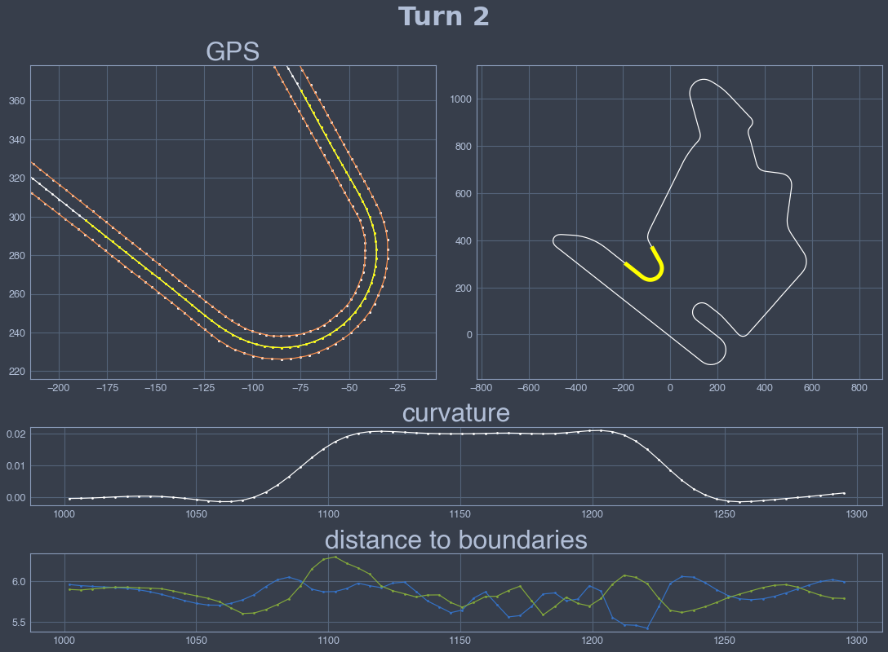
    


    
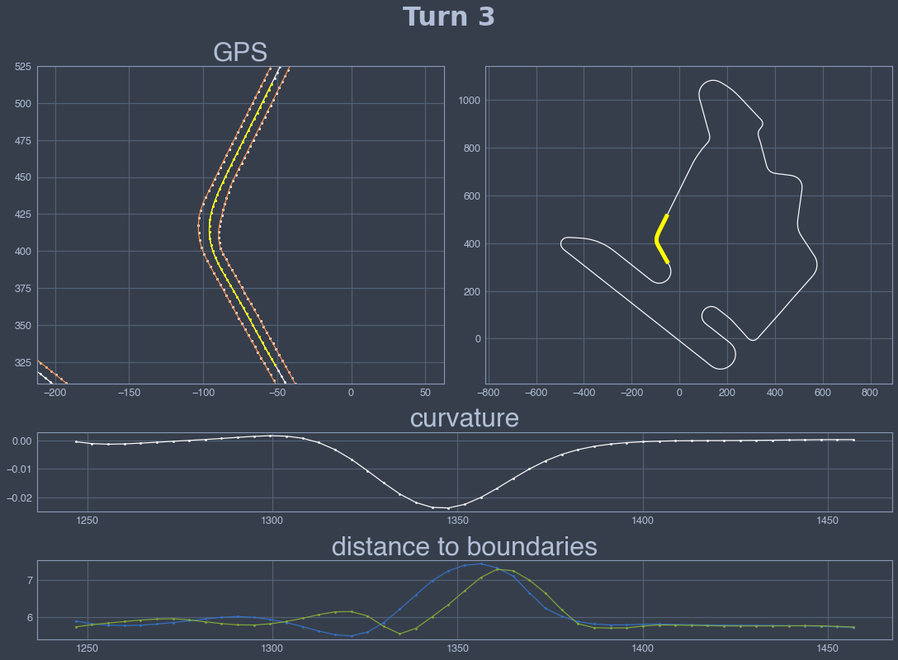
    


    
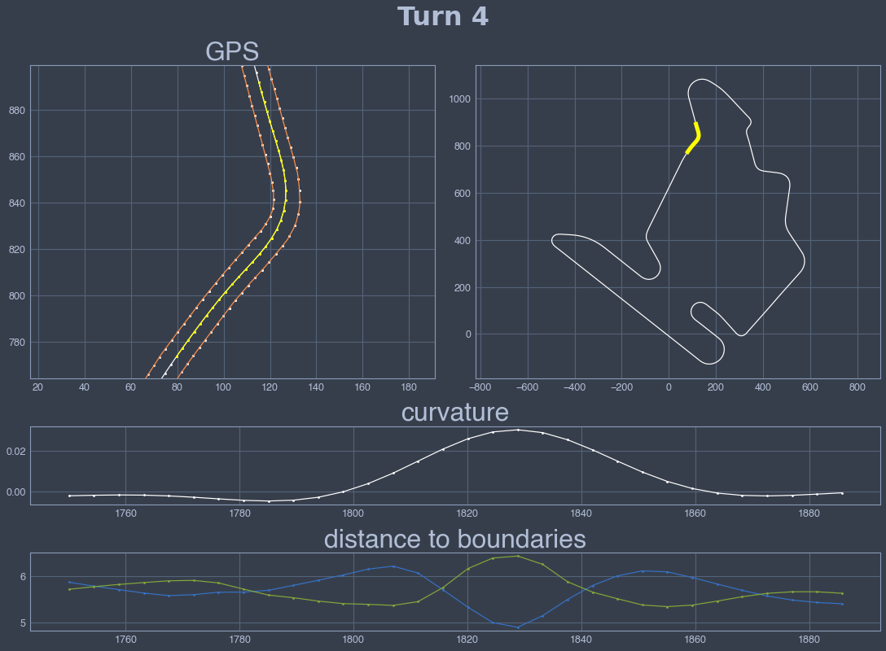
    


    
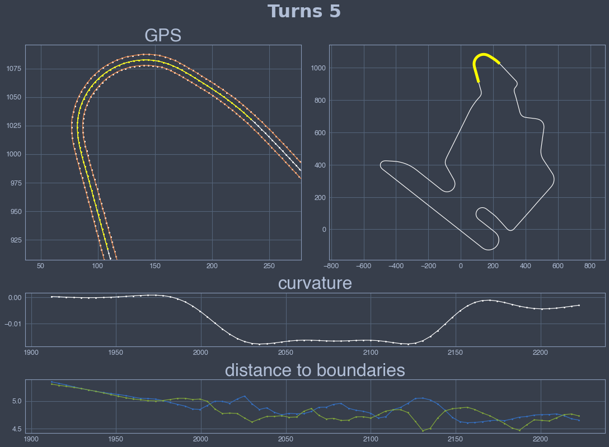
    


    
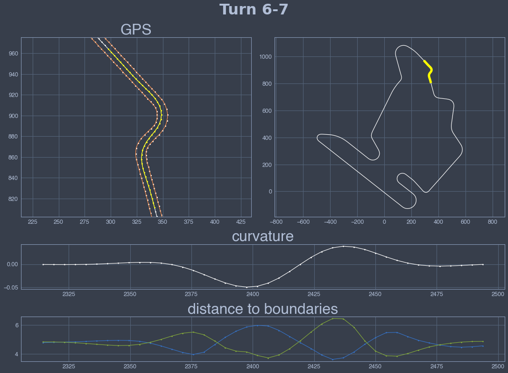
    


    
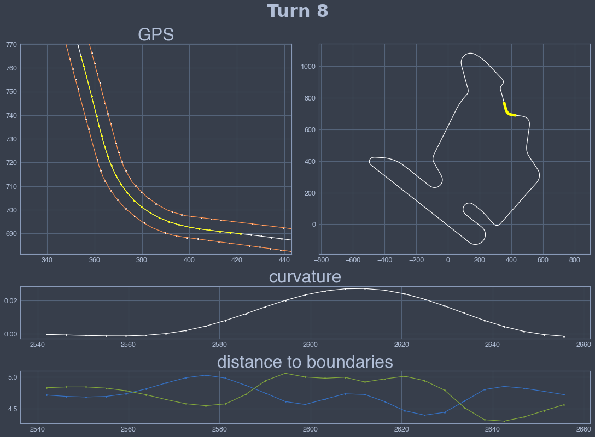
    


    
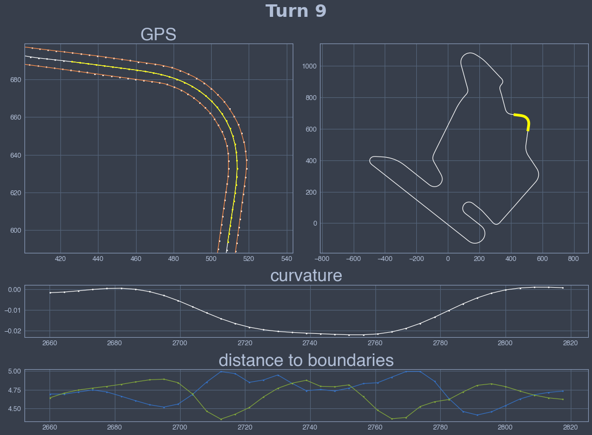
    


    
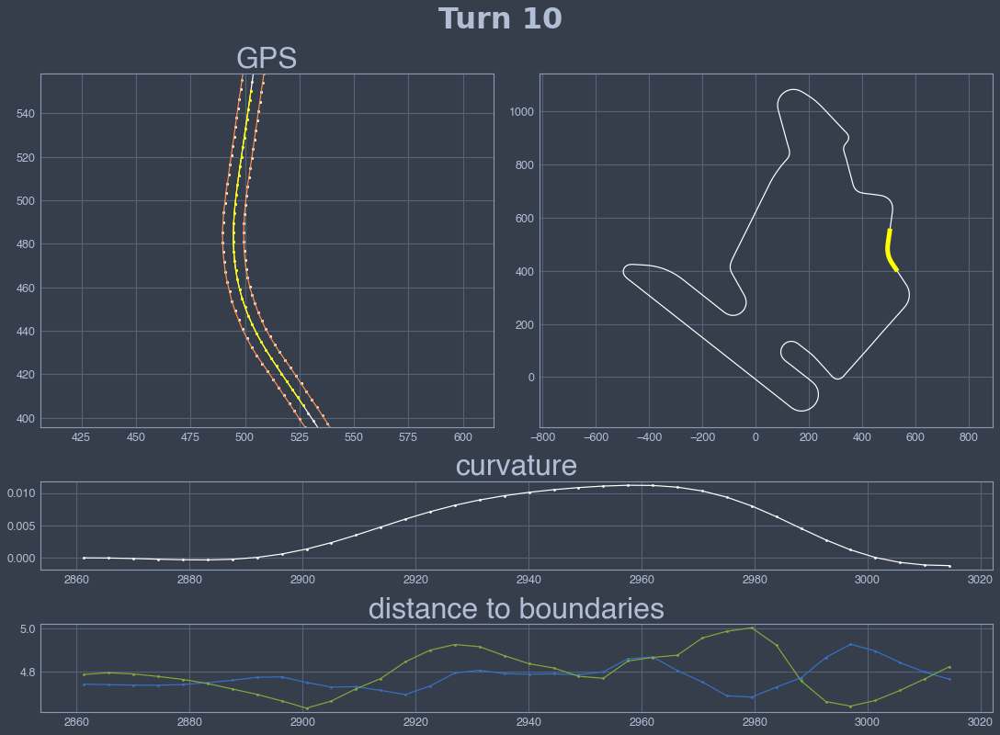
    


    
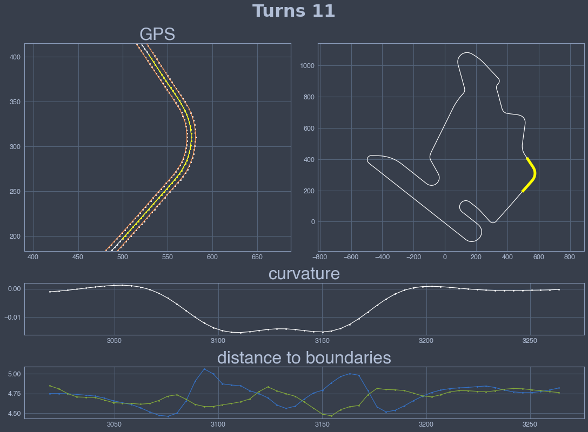
    


    
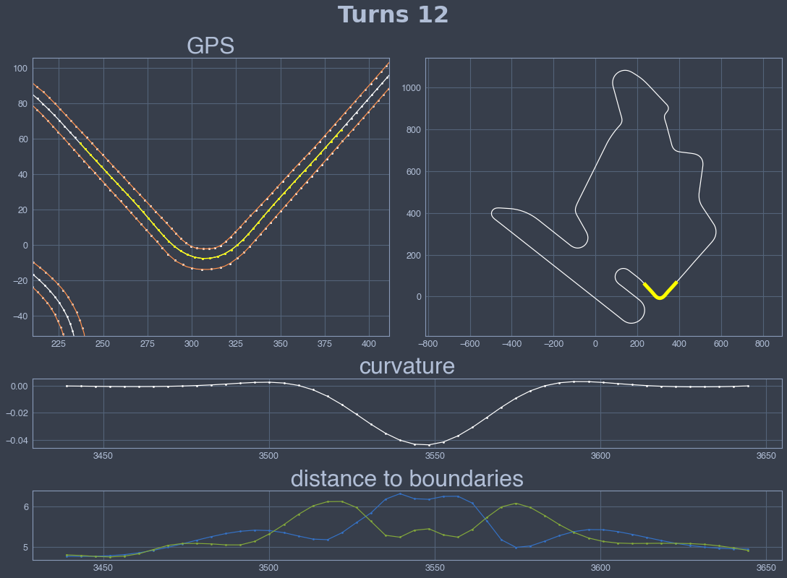
    


    
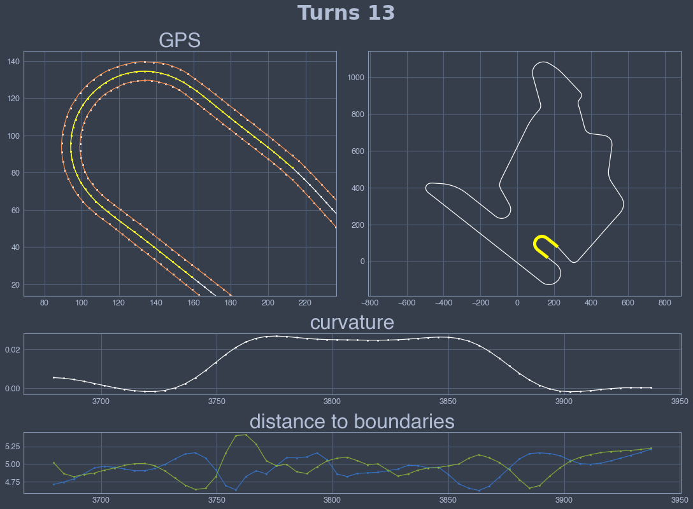
    


    
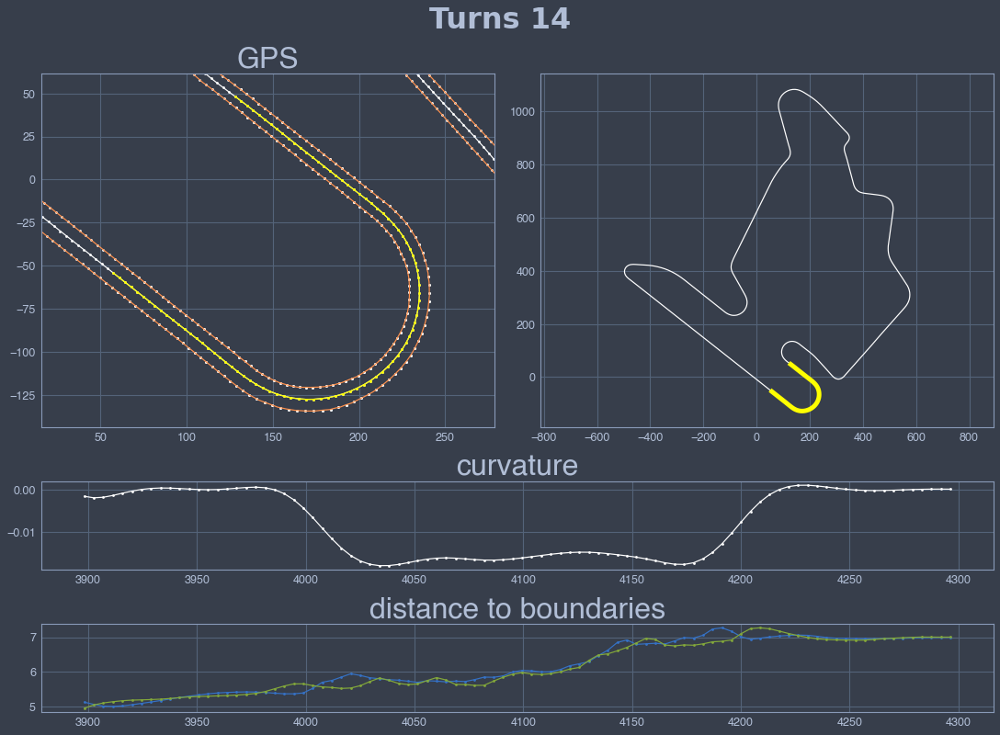
    

