# Circuit preprocessor: Jarama 2022


```python
import sys,os,inspect
fastest_lap_top_level=os.path.dirname(os.path.dirname(os.path.dirname(os.path.dirname(os.path.abspath(inspect.getfile(inspect.currentframe()))))))
sys.path.append(fastest_lap_top_level + '/examples/python')
import fastest_lap
import fastest_lap_utils
```


```python
options = "<options>"
options += "    <kml_files>"
options += "        <left>../../../database/tracks/jarama/jarama_left.kml</left>"
options += "        <right>../../../database/tracks/jarama/jarama_right.kml</right>"
options += "    </kml_files>"
options += "    <mode>equally-spaced</mode>"
options += "    <is_closed>true</is_closed>"
options += "    <number_of_elements>1000</number_of_elements>"
options += "    <xml_file_name>jarama.xml</xml_file_name>"
options += "    <output_variables>"
options += "        <prefix>track/</prefix>"
options += "    </output_variables>"
options += "</options>"

fastest_lap.circuit_preprocessor(options)
```


```python
fastest_lap_utils.plot_turn(525, 810, "Turn 1")
fastest_lap_utils.plot_turn(840, 1070, "Turn 2")
fastest_lap_utils.plot_turn(1100, 1280, "Turn 3")
fastest_lap_utils.plot_turn(1280, 1425, "Turn 4")
fastest_lap_utils.plot_turn(1425, 1710, "Turns 5")
fastest_lap_utils.plot_turn(1800, 2060, "Turn 6")
fastest_lap_utils.plot_turn(2104, 2480, "Turns 7")
fastest_lap_utils.plot_turn(2600, 2850, "Turn 8")
fastest_lap_utils.plot_turn(2800, 3075, "Turn 9")
fastest_lap_utils.plot_turn(3120, 3500, "Turn 10")
fastest_lap_utils.plot_turn(3420, 3720, "Turns 11")
```


    
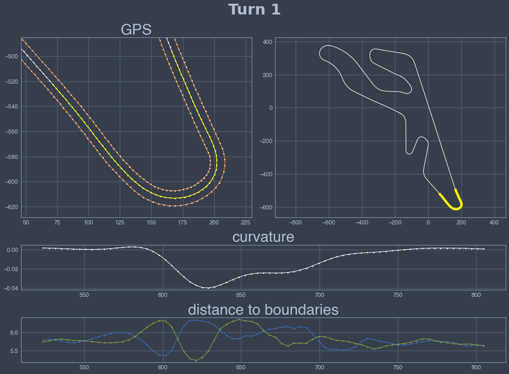
    


    
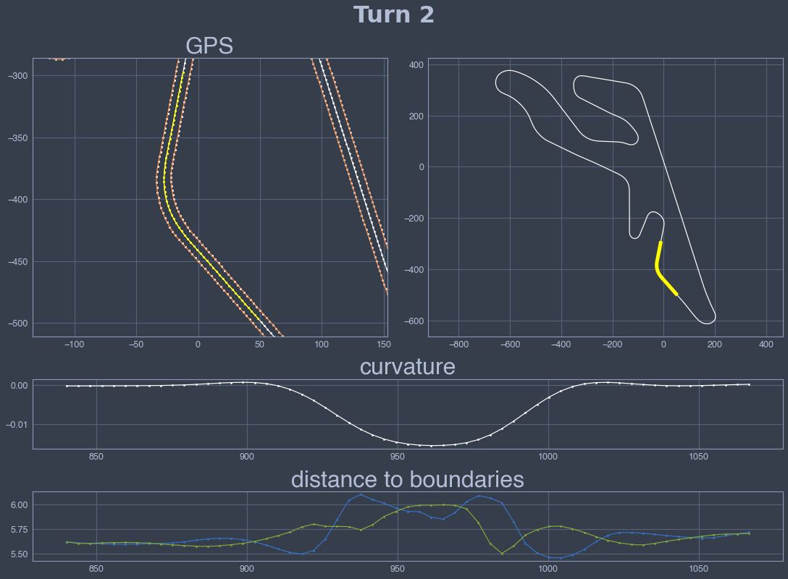
    


    
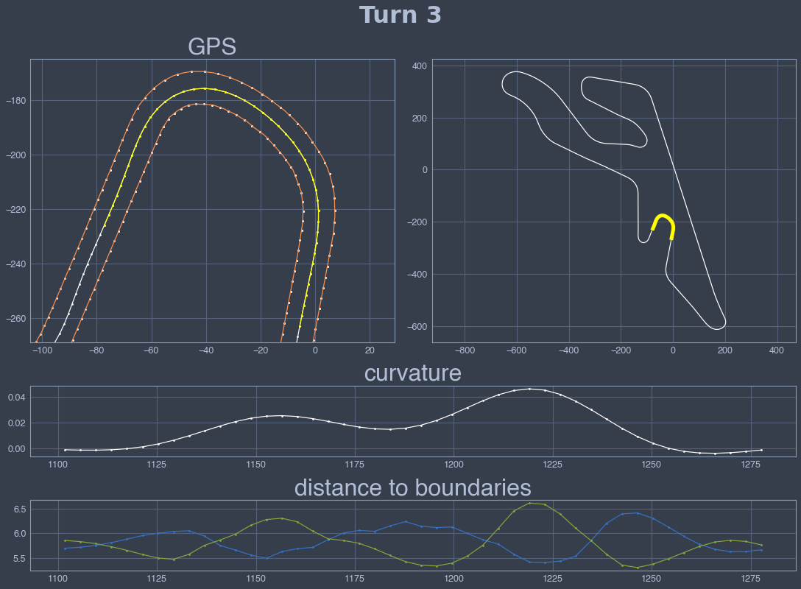
    


    
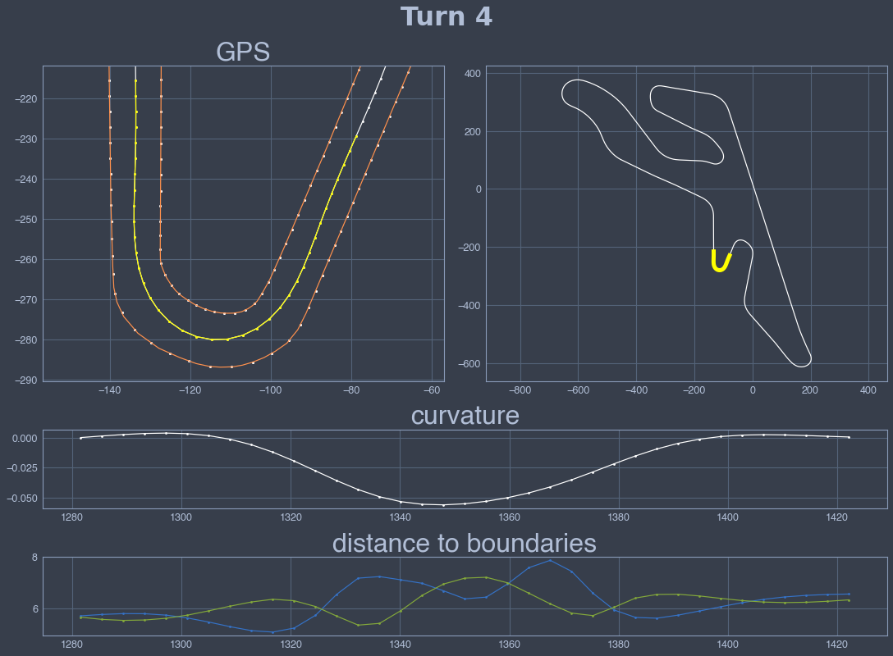
    


    
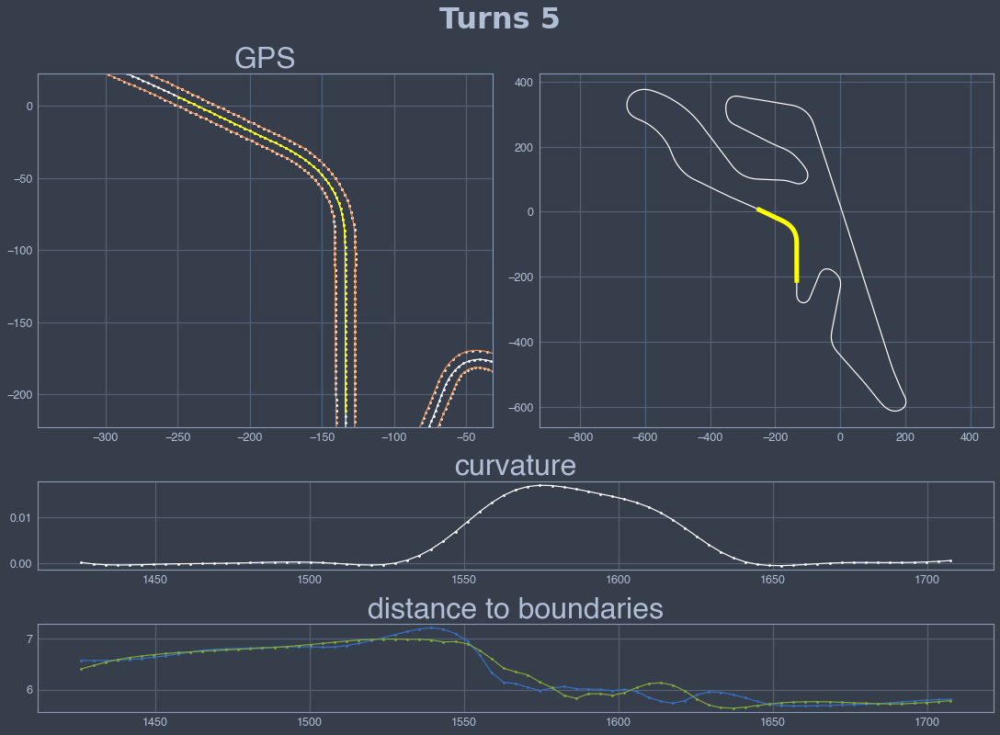
    


    
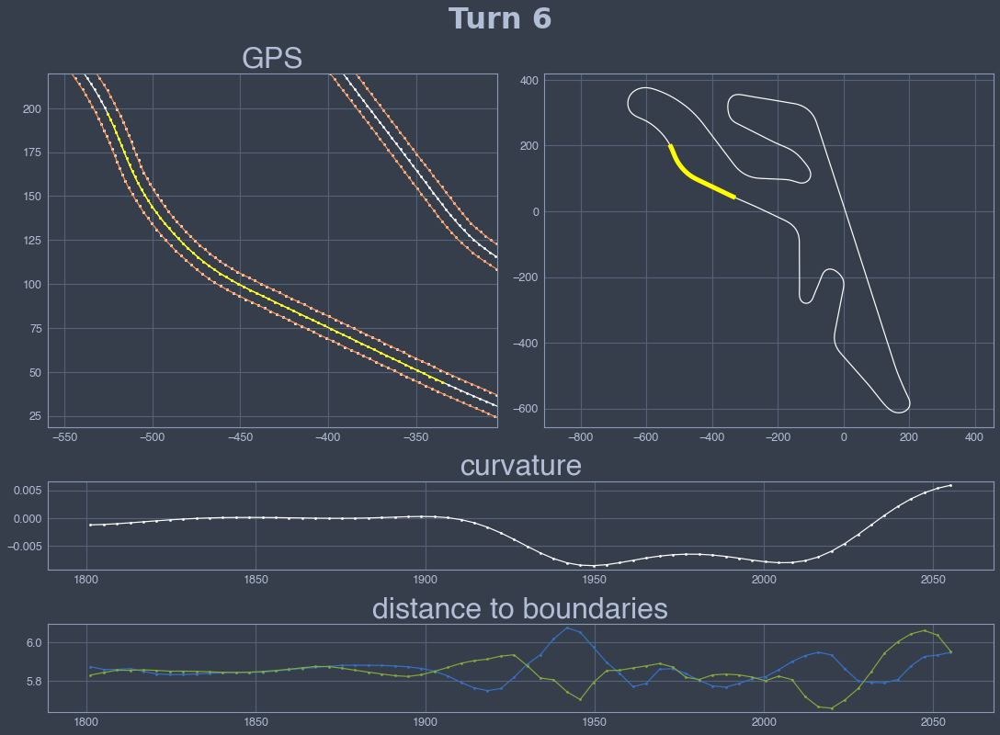
    


    
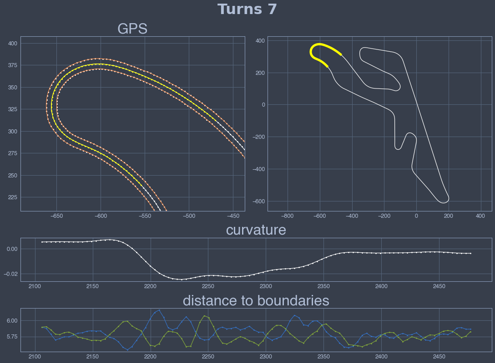
    


    
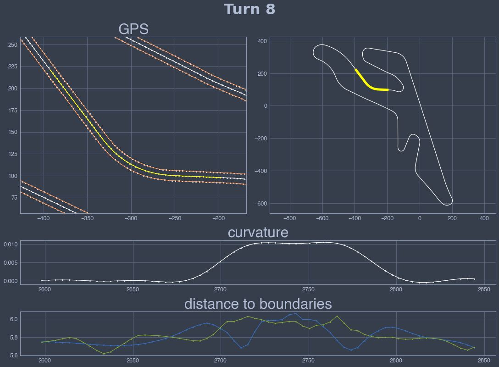
    


    
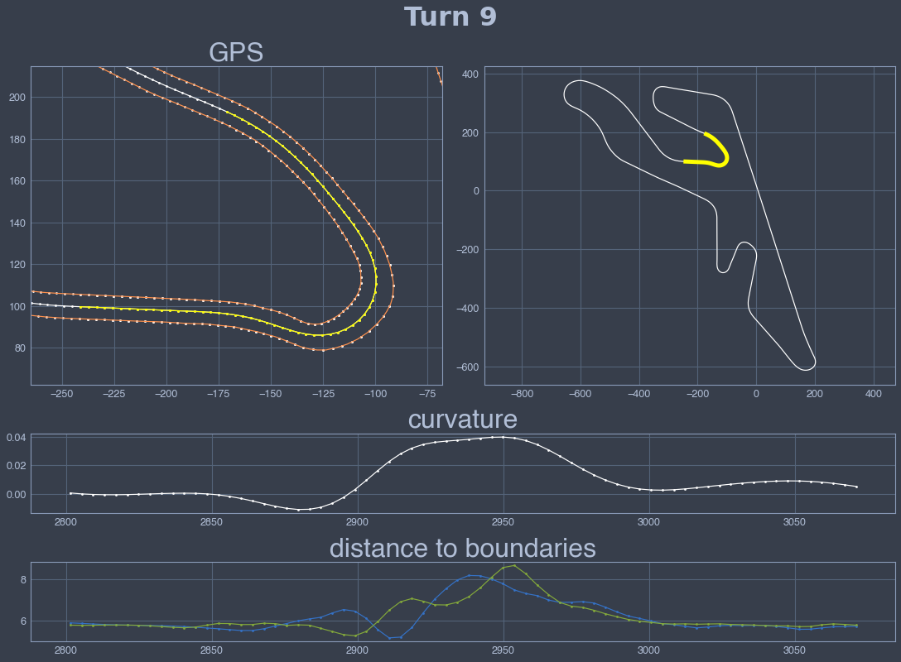
    


    
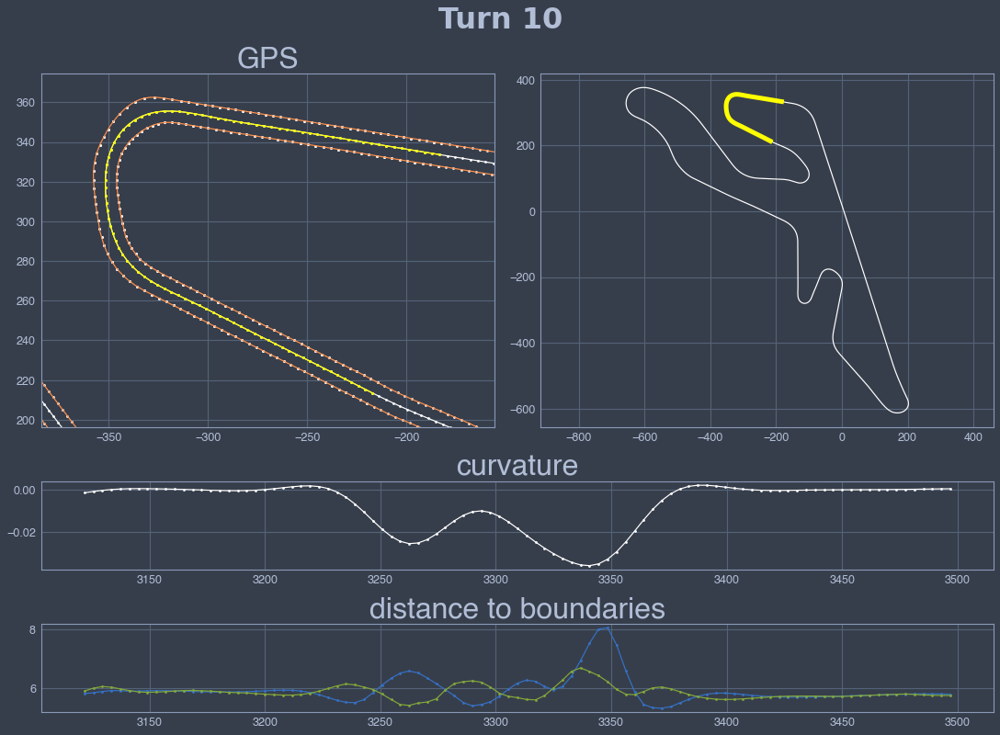
    


    
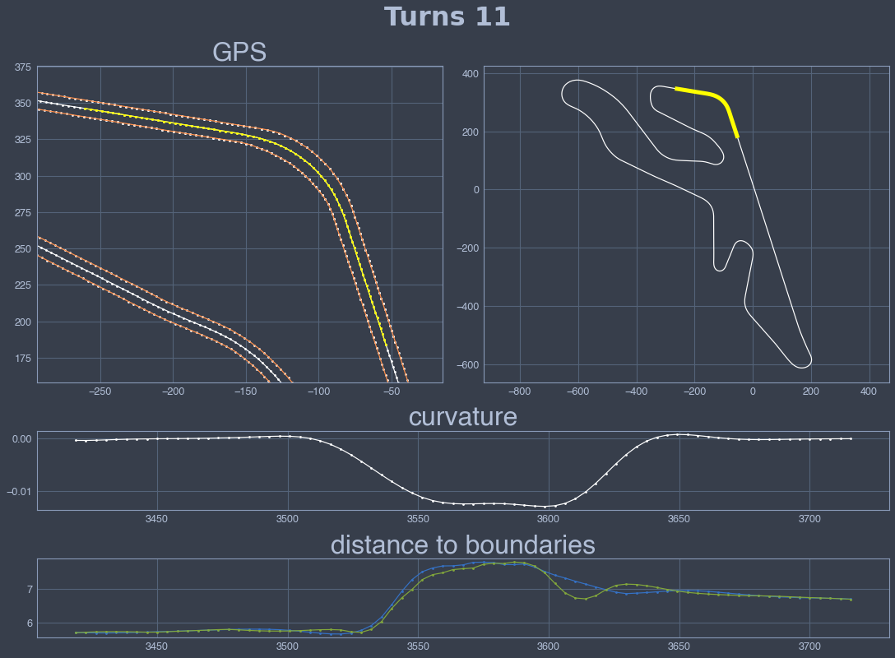
    

