# Circuit preprocessor: Pau Ville 2022


```python
import sys,os,inspect
fastest_lap_top_level=os.path.dirname(os.path.dirname(os.path.dirname(os.path.dirname(os.path.abspath(inspect.getfile(inspect.currentframe()))))))
sys.path.append(fastest_lap_top_level + '/examples/python')
import fastest_lap
import fastest_lap_utils
```


```python
options = "<options>"
options += "    <kml_files>"
options += "        <left>../../../database/tracks/pau_ville/pau_ville_left.kml</left>"
options += "        <right>../../../database/tracks/pau_ville/pau_ville_right.kml</right>"
options += "    </kml_files>"
options += "    <mode>equally-spaced</mode>"
options += "    <is_closed>true</is_closed>"
options += "    <number_of_elements>1000</number_of_elements>"
options += "    <xml_file_name>pau_ville.xml</xml_file_name>"
options += "    <output_variables>"
options += "        <prefix>track/</prefix>"
options += "    </output_variables>"
options += "</options>"

fastest_lap.circuit_preprocessor(options)
```


```python
fastest_lap_utils.plot_turn(0, 230, "Turn 1")
fastest_lap_utils.plot_turn(280, 450, "Turn 2")
fastest_lap_utils.plot_turn(775, 950, "Turn 3")
fastest_lap_utils.plot_turn(950, 1100, "Turn 4")
fastest_lap_utils.plot_turn(1100, 1390, "Turn 5")
fastest_lap_utils.plot_turn(1400, 1680, "Turn 6")
fastest_lap_utils.plot_turn(1700, 1900, "Turn 7-8")
fastest_lap_utils.plot_turn(1900, 2050, "Turns 9")
fastest_lap_utils.plot_turn(2010, 2090, "Turns 10")
fastest_lap_utils.plot_turn(2090, 2240, "Turns 11-12-13")
fastest_lap_utils.plot_turn(2240, 2360, "Turns 14")
fastest_lap_utils.plot_turn(2360, 2550, "Turns 15")
```


    
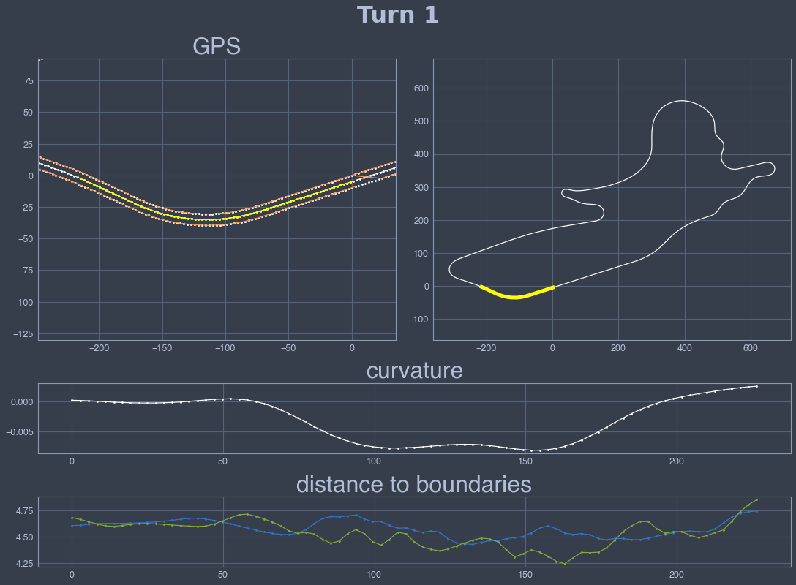
    


    
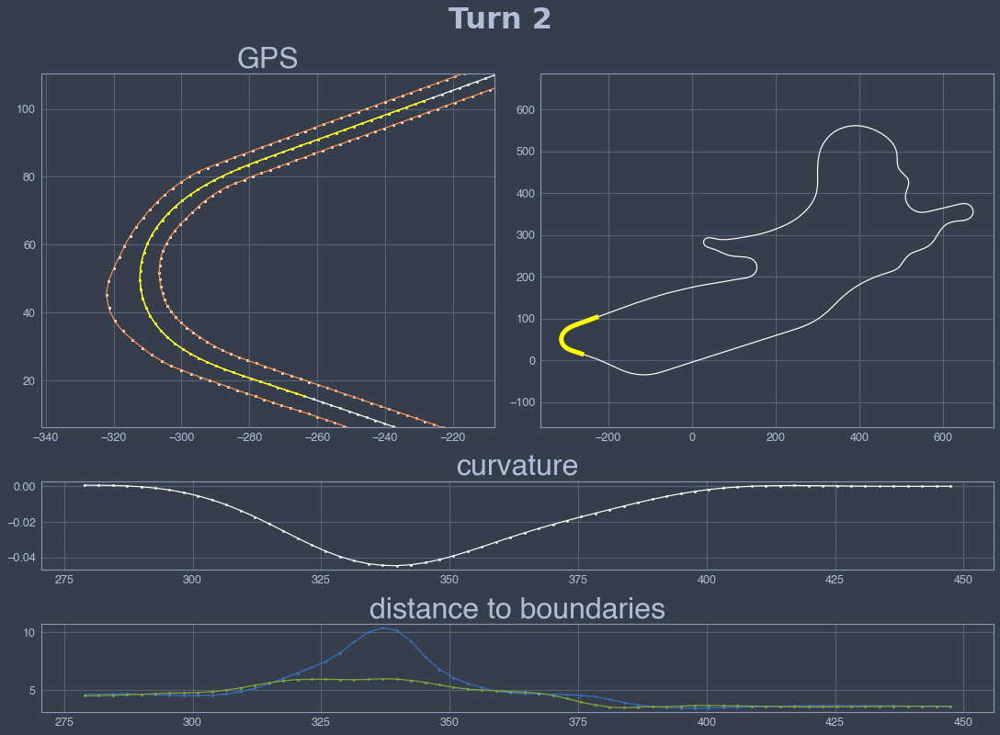
    


    
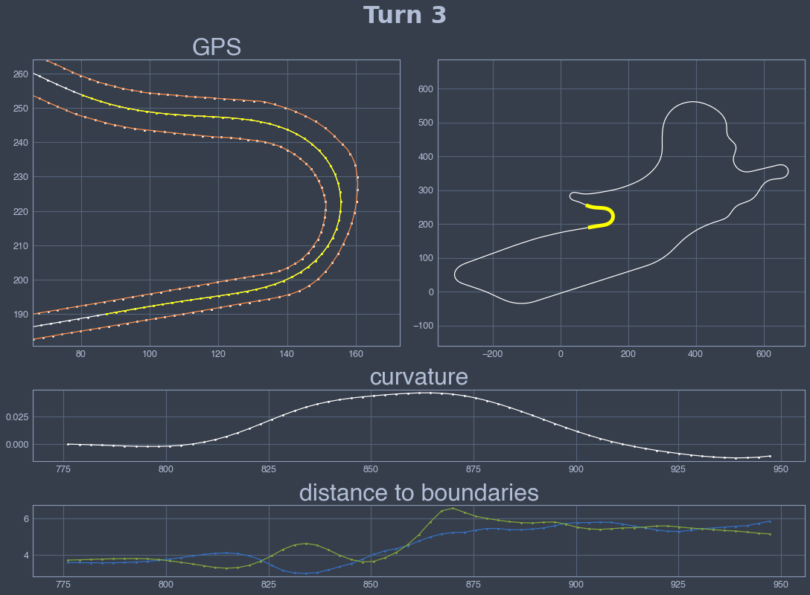
    


    
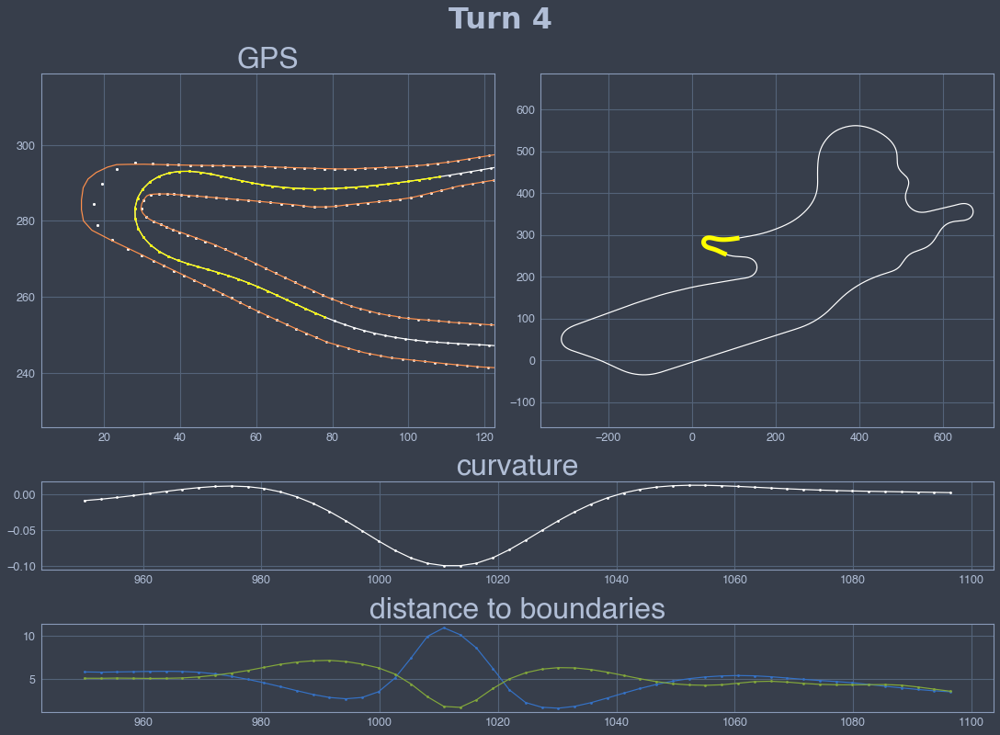
    


    
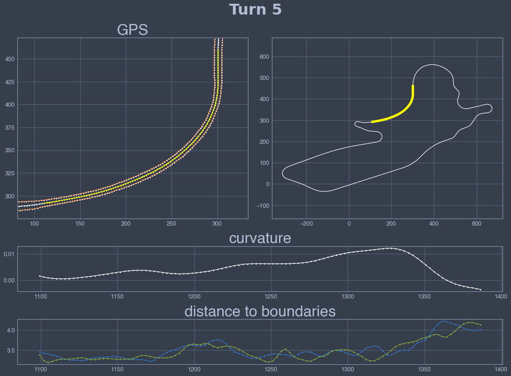
    


    
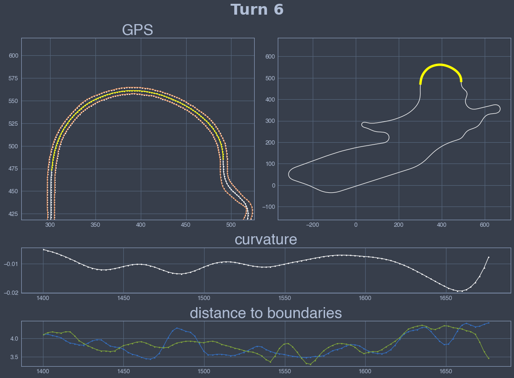
    


    
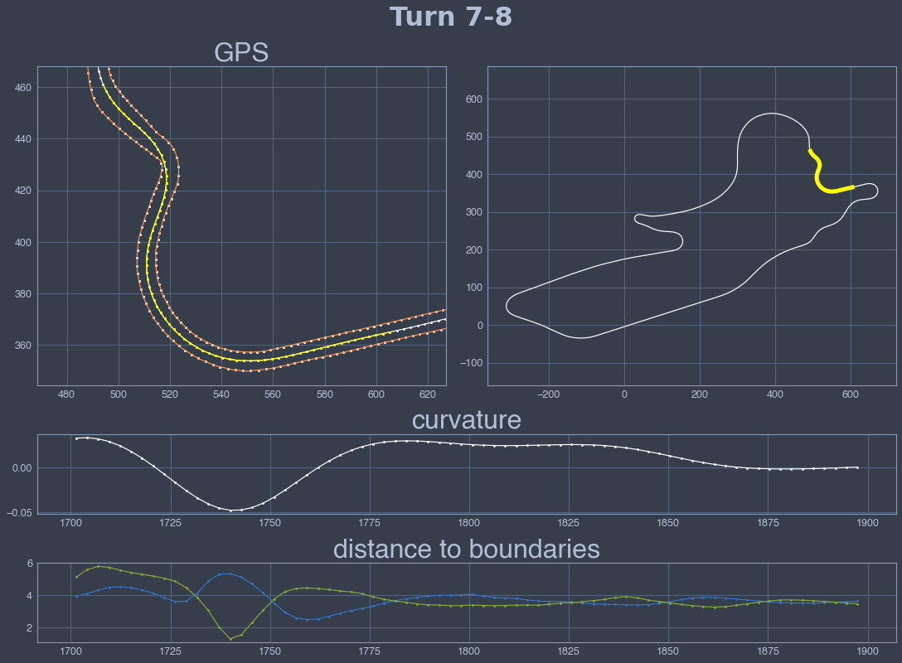
    


    
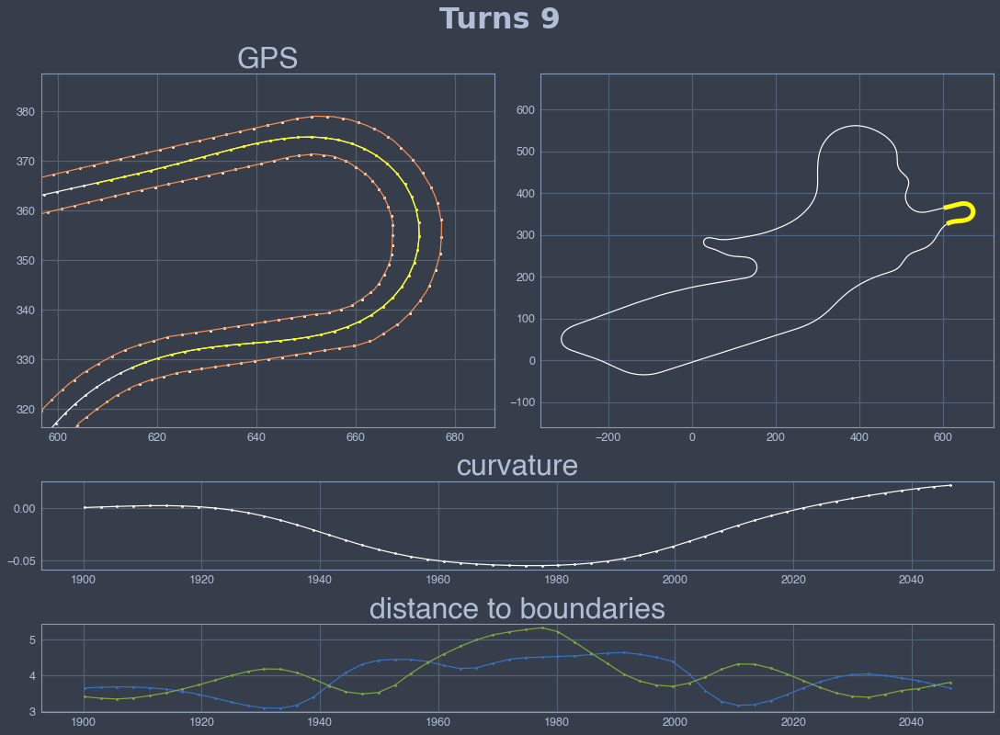
    


    
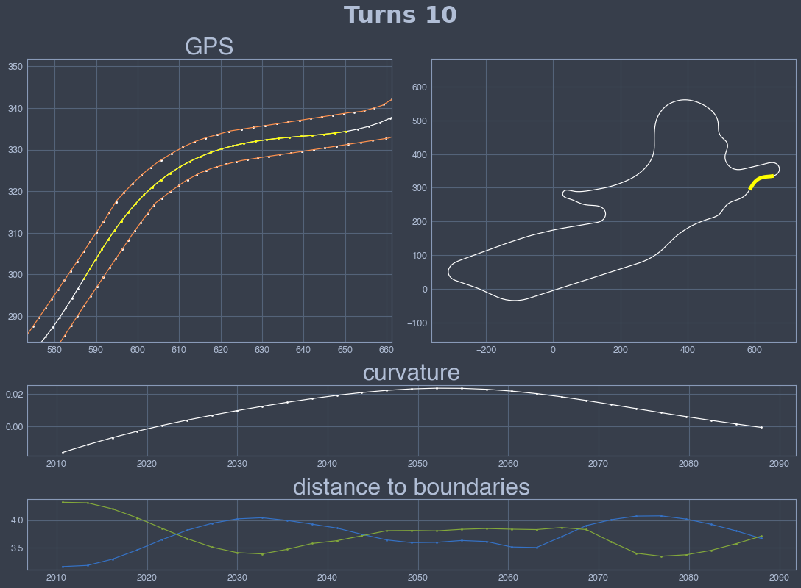
    


    
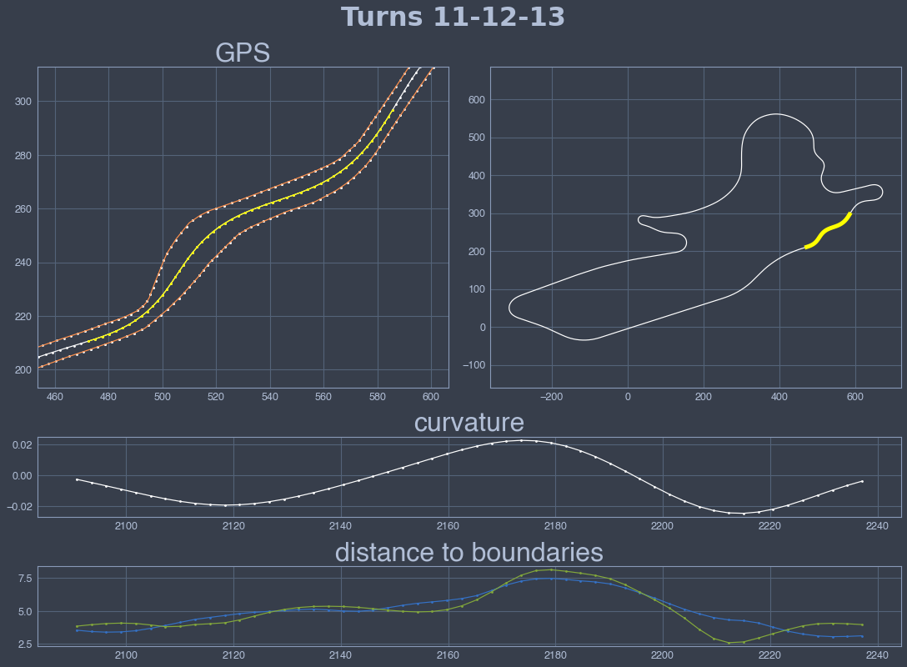
    


    
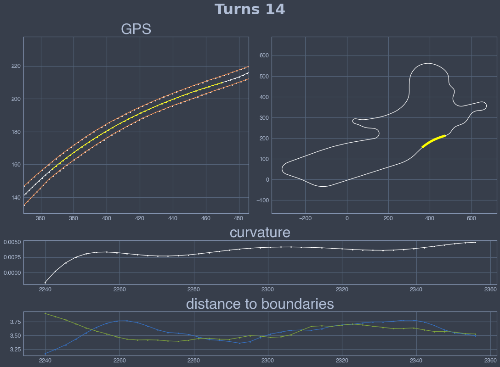
    


    
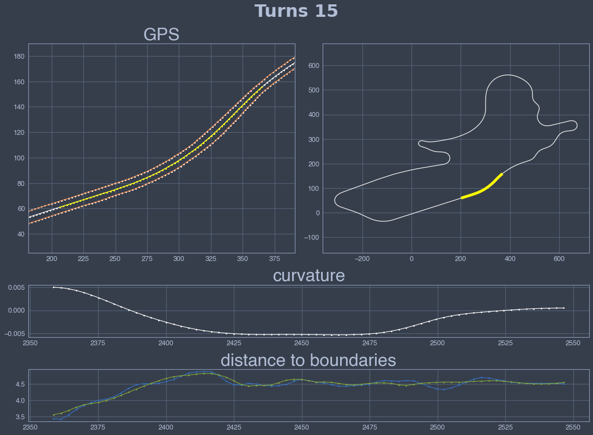
    

