# Circuit preprocessor: Sachsenring 2022


```python
import sys,os,inspect
fastest_lap_top_level=os.path.dirname(os.path.dirname(os.path.dirname(os.path.dirname(os.path.abspath(inspect.getfile(inspect.currentframe()))))))
sys.path.append(fastest_lap_top_level + '/examples/python')
import fastest_lap
import fastest_lap_utils
```


```python
options = "<options>"
options += "    <kml_files>"
options += "        <left>../../../database/tracks/sachsenring/sachsenring_left.kml</left>"
options += "        <right>../../../database/tracks/sachsenring/sachsenring_right.kml</right>"
options += "    </kml_files>"
options += "    <mode>equally-spaced</mode>"
options += "    <is_closed>true</is_closed>"
options += "    <number_of_elements>1000</number_of_elements>"
options += "    <xml_file_name>sachsenring.xml</xml_file_name>"
options += "    <output_variables>"
options += "        <prefix>track/</prefix>"
options += "    </output_variables>"
options += "</options>"

fastest_lap.circuit_preprocessor(options)
```


```python
fastest_lap_utils.plot_turn(250, 430, "Turn 1")
fastest_lap_utils.plot_turn(430, 620, "Turn 2")
fastest_lap_utils.plot_turn(640, 840, "Turn 3")
fastest_lap_utils.plot_turn(830, 940, "Turn 4")
fastest_lap_utils.plot_turn(940, 1050, "Turn 5")
fastest_lap_utils.plot_turn(1020, 1160, "Turn 6")
fastest_lap_utils.plot_turn(1180, 1590, "Turn 7")
fastest_lap_utils.plot_turn(1600, 1890, "Turn 8")
fastest_lap_utils.plot_turn(1890, 2040, "Turns 9")
fastest_lap_utils.plot_turn(2010, 2240, "Turns 10")
fastest_lap_utils.plot_turn(2200, 2500, "Turns 11")
fastest_lap_utils.plot_turn(2700, 3000, "Turns 12")
fastest_lap_utils.plot_turn(3100, 3400, "Turns 13")
```


    
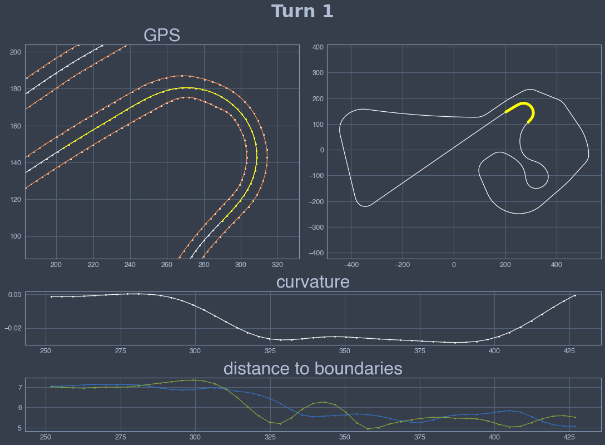
    


    
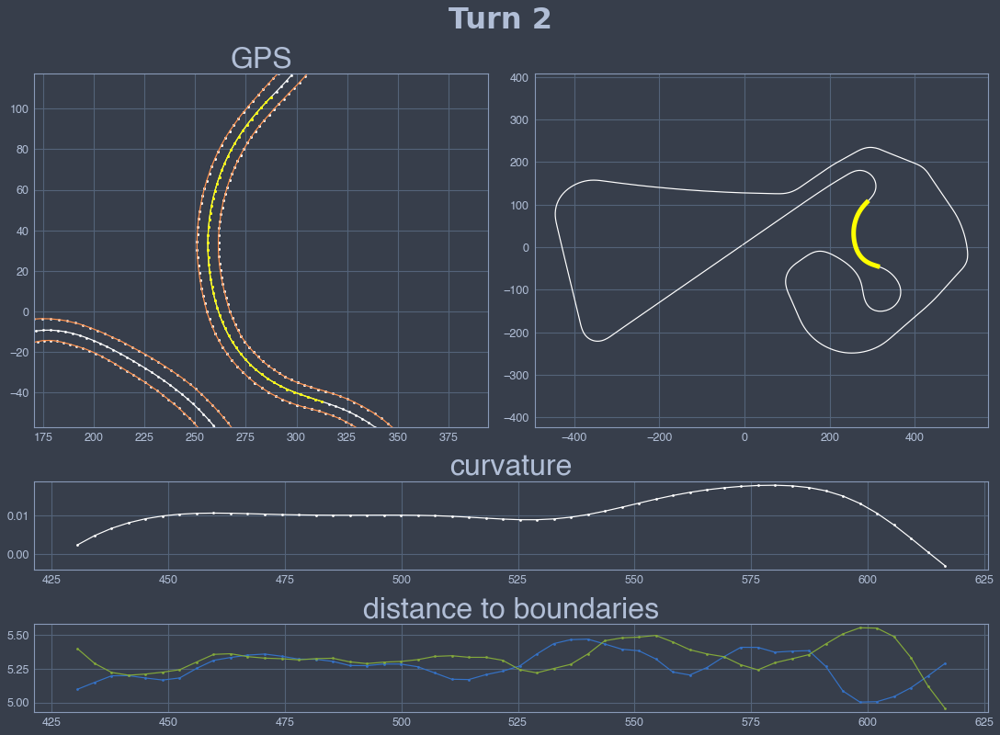
    


    
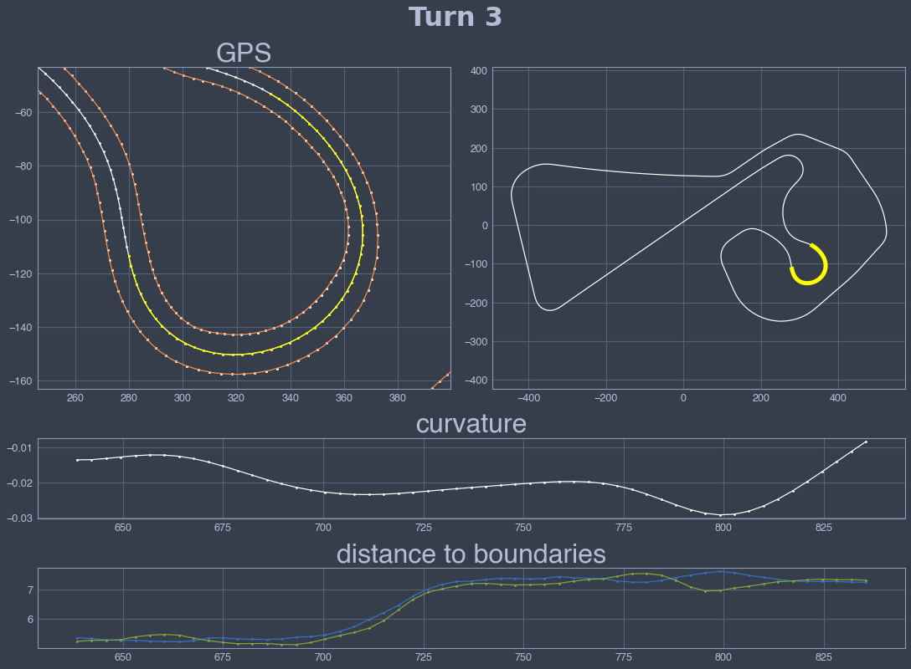
    


    
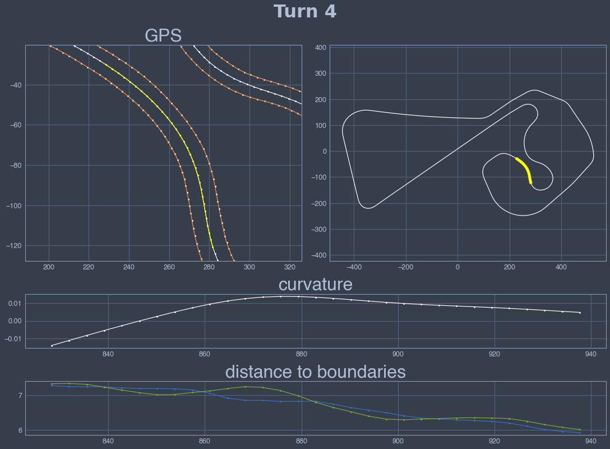
    


    
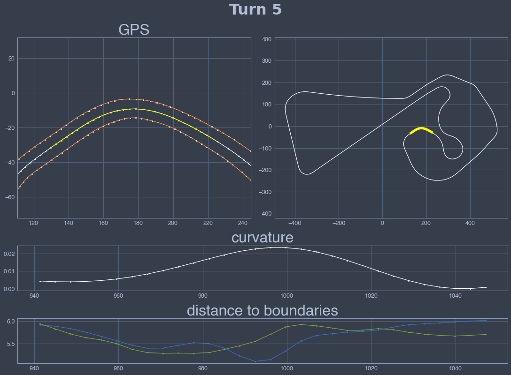
    


    
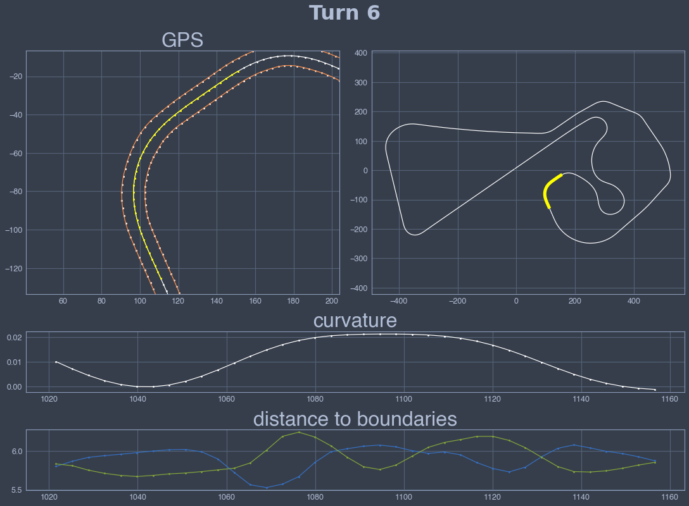
    


    
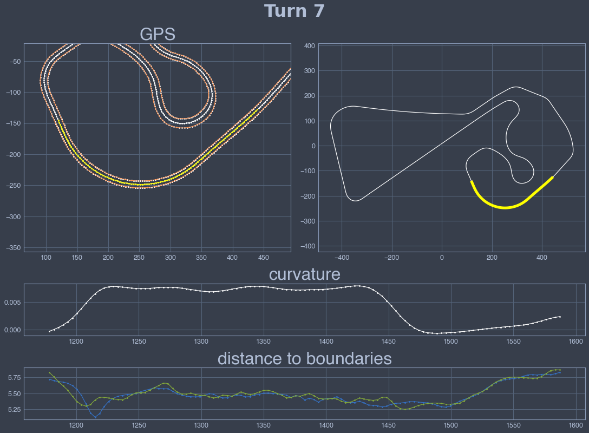
    


    
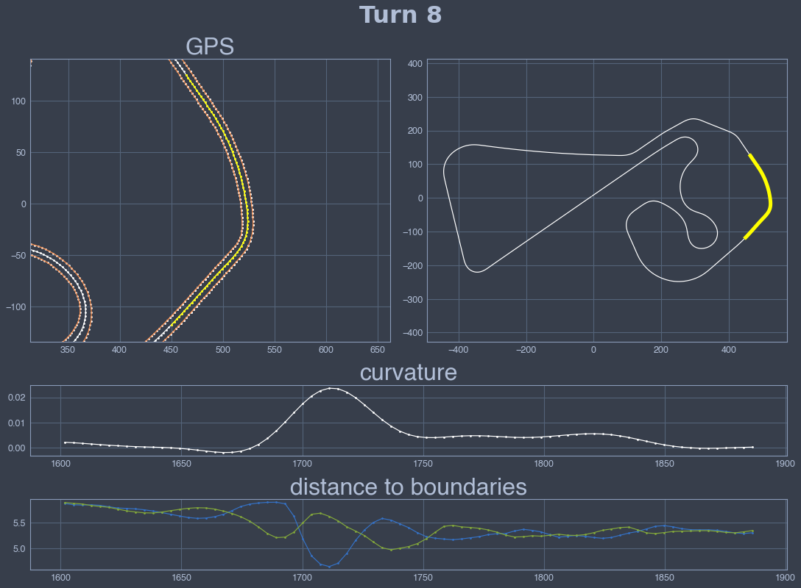
    


    
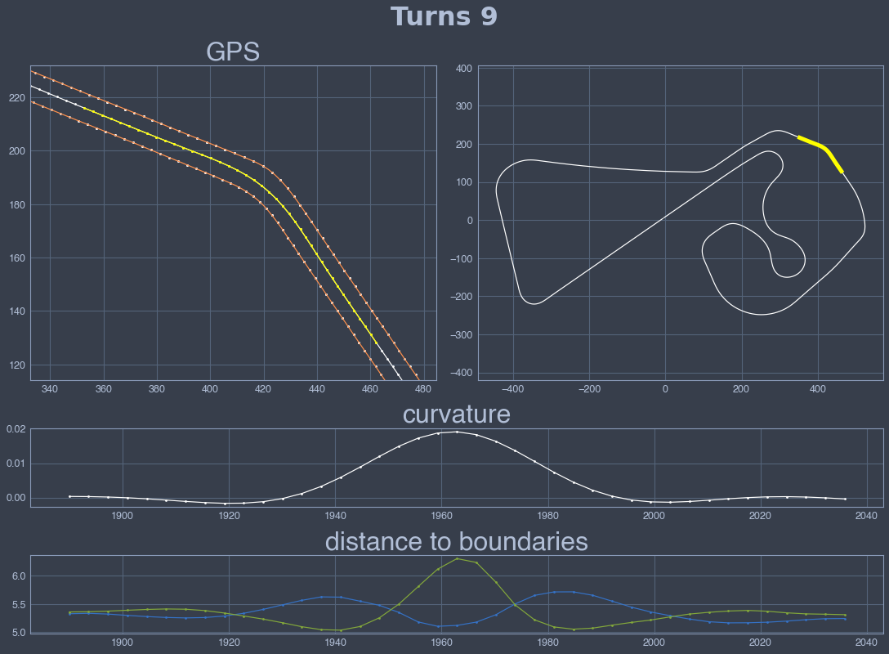
    


    

    


    
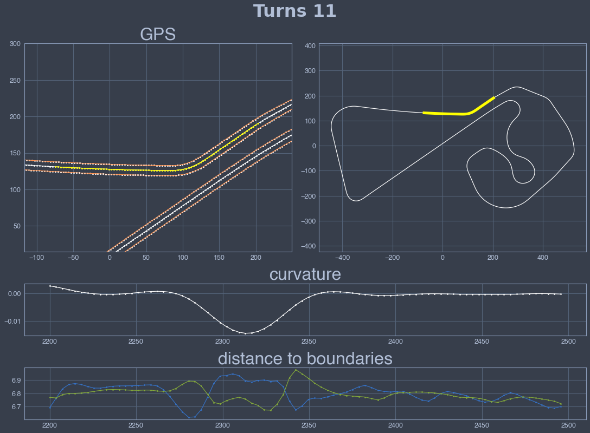
    


    
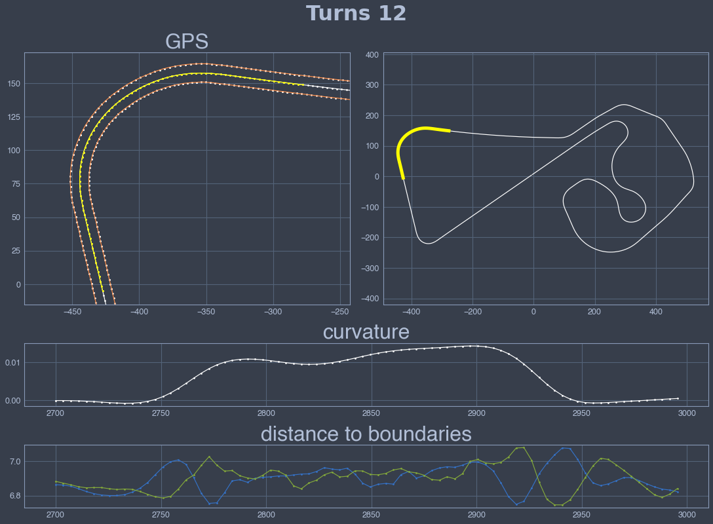
    


    
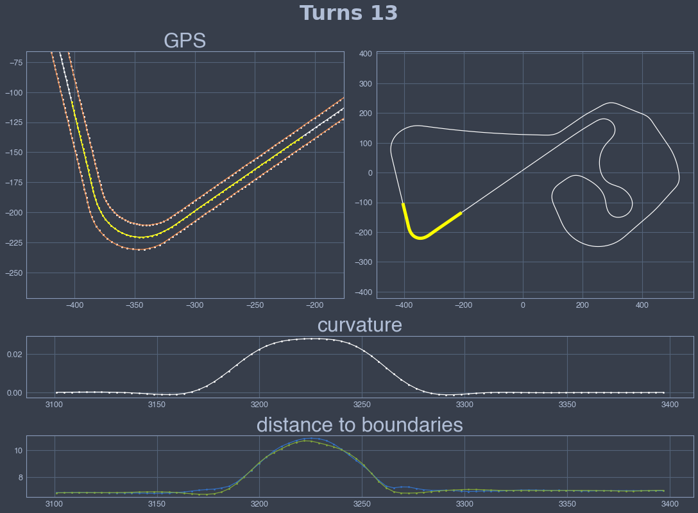
    

