# Circuit preprocessor: Vallelunga 3.243km layout 2022


```python
import sys,os,inspect
fastest_lap_top_level=os.path.dirname(os.path.dirname(os.path.dirname(os.path.dirname(os.path.abspath(inspect.getfile(inspect.currentframe()))))))
sys.path.append(fastest_lap_top_level + '/examples/python')
import fastest_lap
import fastest_lap_utils
```


```python
options = "<options>"
options += "    <kml_files>"
options += "        <left>../../../database/tracks/vallelunga/vallelunga_3243_left.kml</left>"
options += "        <right>../../../database/tracks/vallelunga/vallelunga_3243_right.kml</right>"
options += "    </kml_files>"
options += "    <mode>equally-spaced</mode>"
options += "    <is_closed>true</is_closed>"
options += "    <number_of_elements>1000</number_of_elements>"
options += "    <xml_file_name>vallelunga_3243.xml</xml_file_name>"
options += "    <output_variables>"
options += "        <prefix>track/</prefix>"
options += "    </output_variables>"
options += "</options>"

fastest_lap.circuit_preprocessor(options)
```


```python
fastest_lap_utils.plot_turn(0, 285, "Turn 1")
fastest_lap_utils.plot_turn(330, 640, "Turn 2")
fastest_lap_utils.plot_turn(640, 865, "Turn 3")
fastest_lap_utils.plot_turn(910, 1090, "Turn 4")
fastest_lap_utils.plot_turn(1090, 1270, "Turns 5")
fastest_lap_utils.plot_turn(1380, 1660, "Turn 6-7-8")
fastest_lap_utils.plot_turn(1660, 1900, "Turns 9")
fastest_lap_utils.plot_turn(1920, 2190, "Turn 10")
fastest_lap_utils.plot_turn(2185, 2360, "Turn 11")
fastest_lap_utils.plot_turn(2380, 2520, "Turn 12")
fastest_lap_utils.plot_turn(2520, 2700, "Turns 13")
fastest_lap_utils.plot_turn(2730, 3090, "Turns 14")
```


    
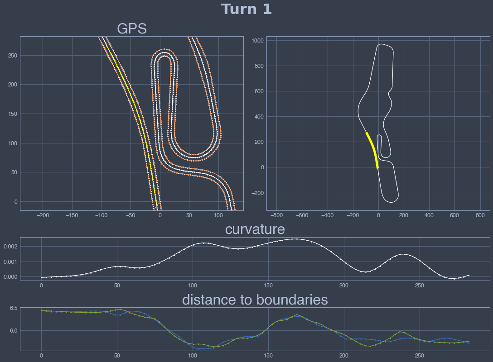
    


    
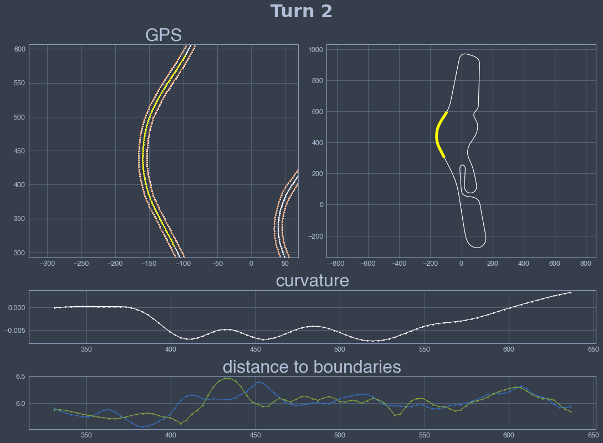
    


    
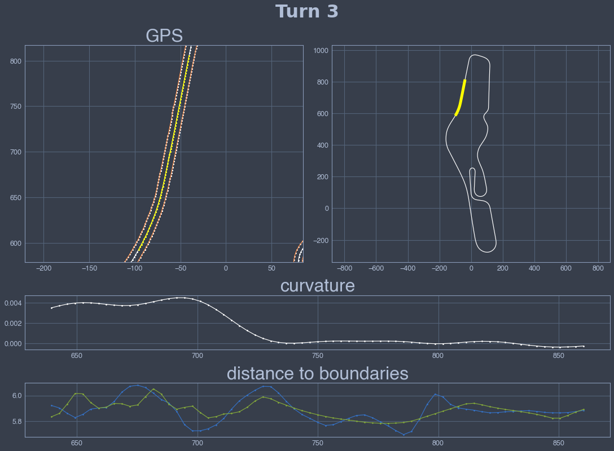
    


    
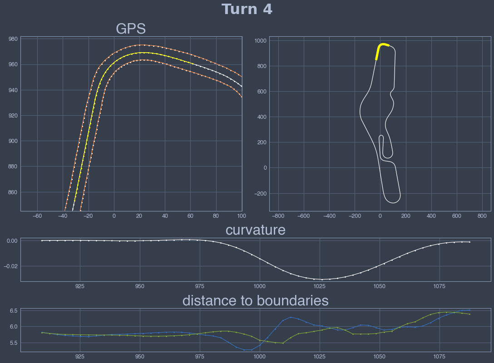
    


    
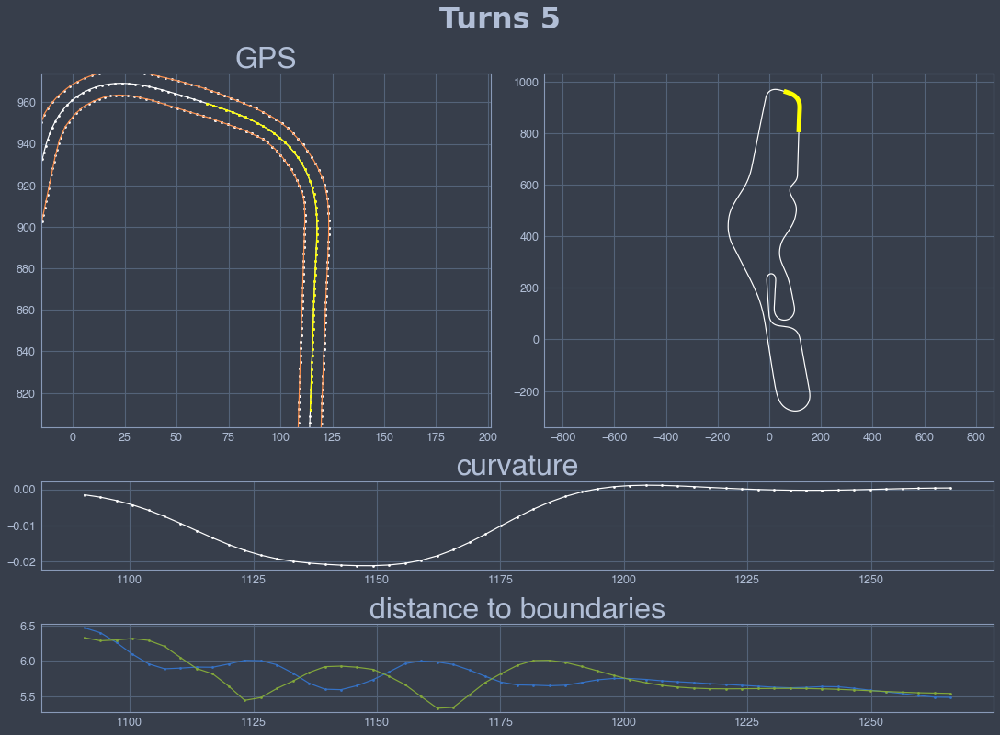
    


    
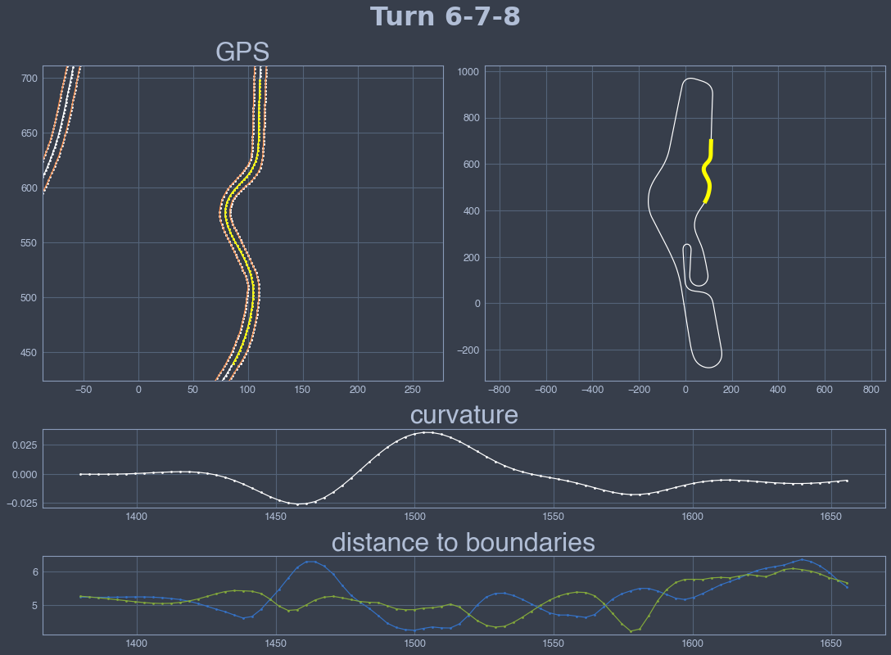
    


    
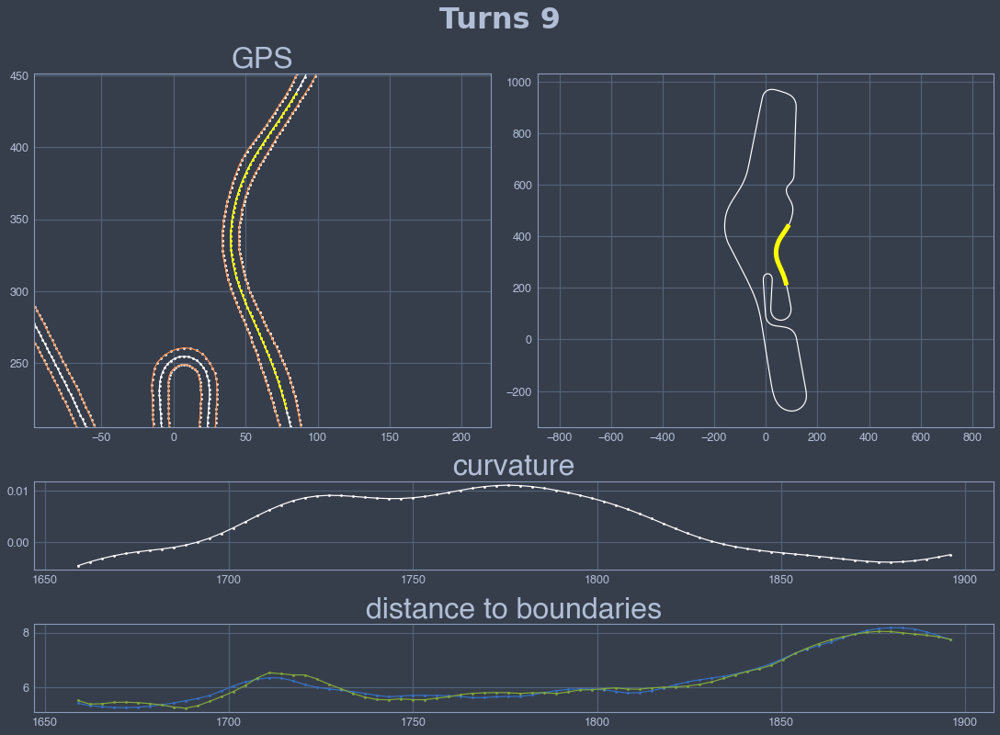
    


    
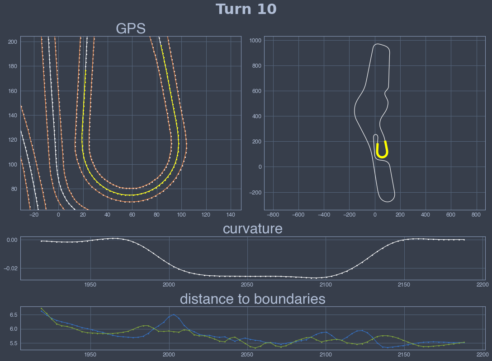
    


    
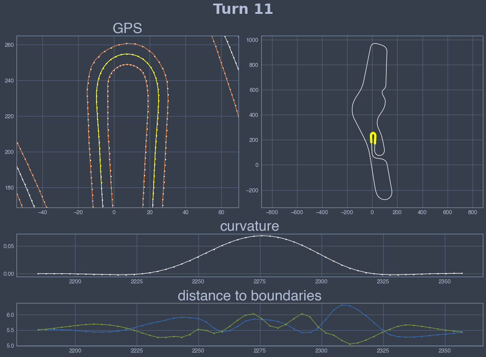
    


    
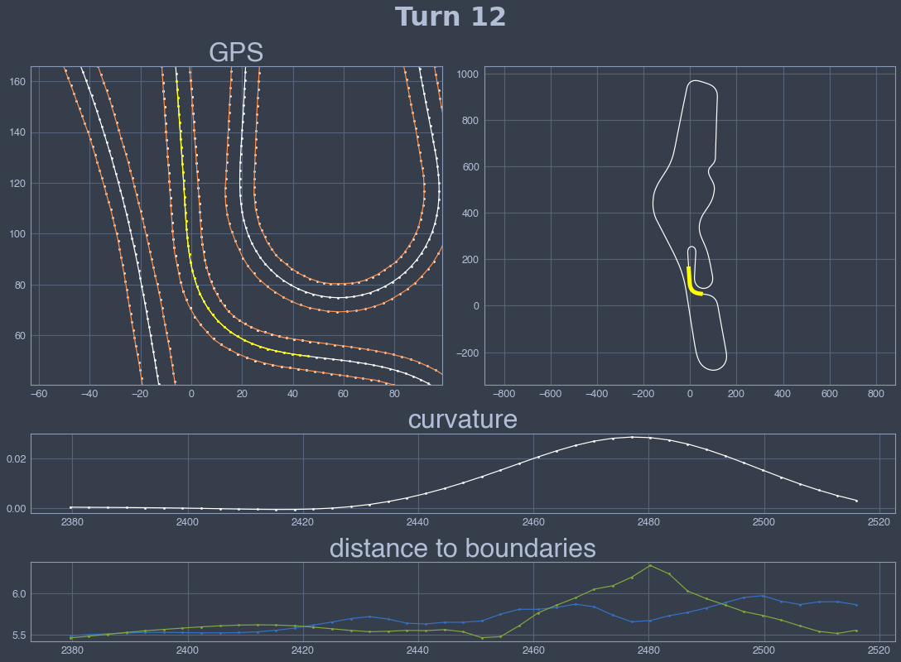
    


    
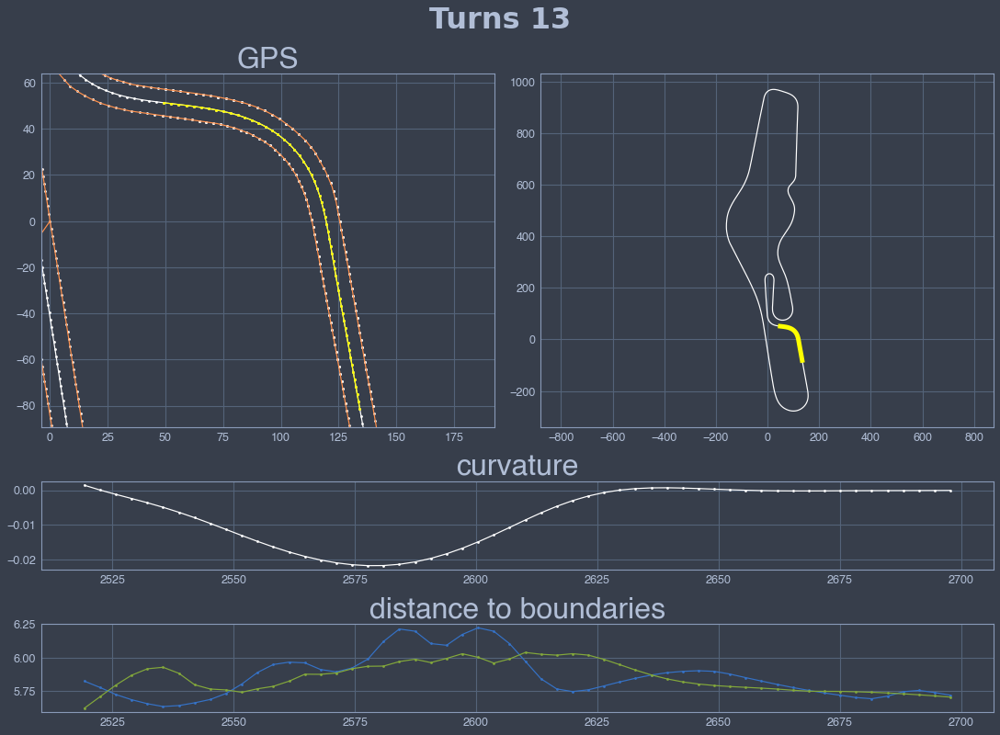
    


    
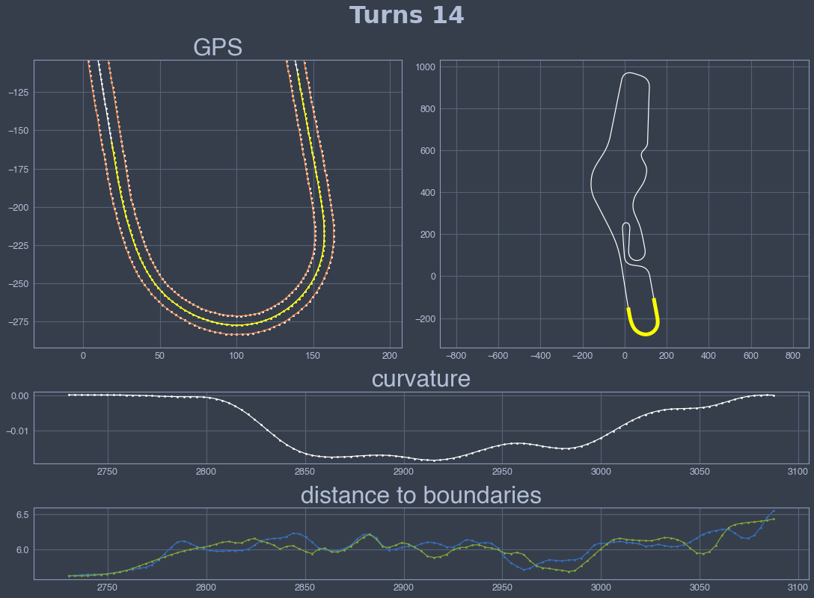
    

