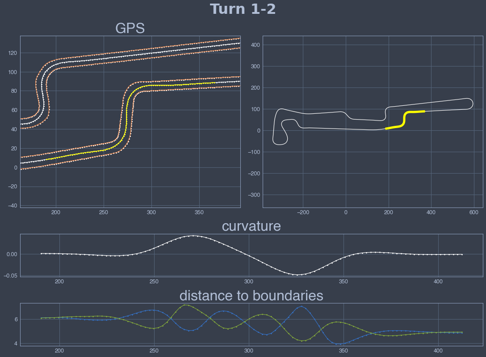
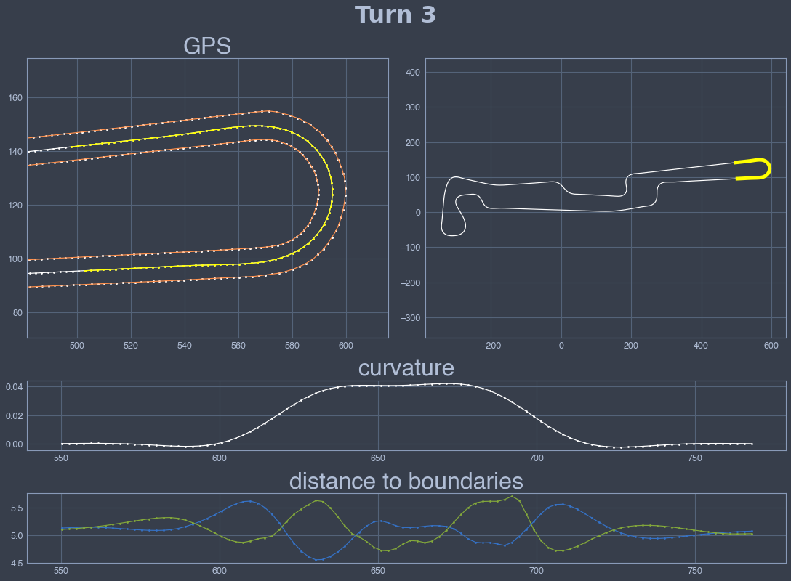
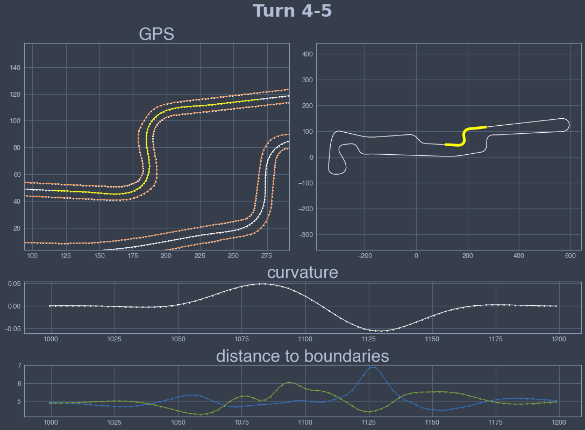
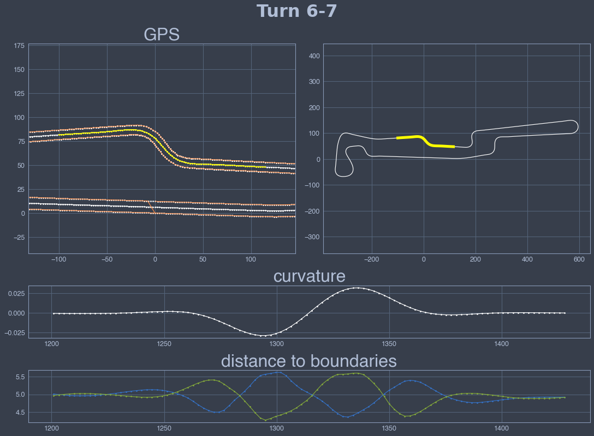
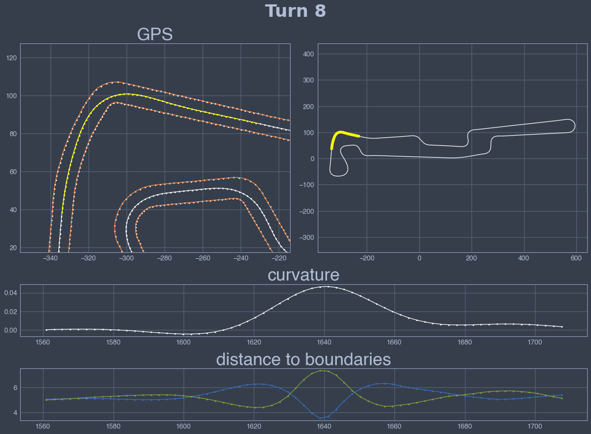
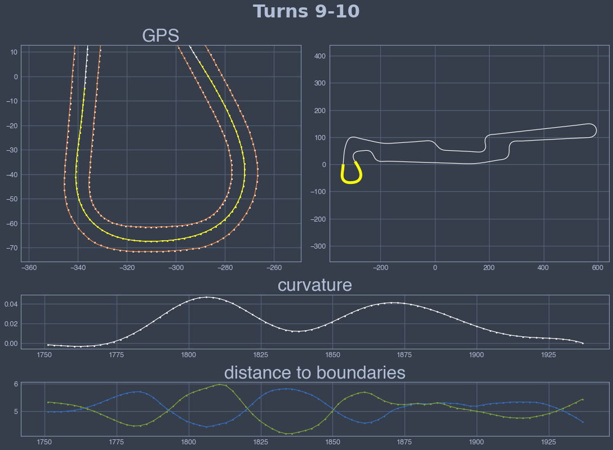
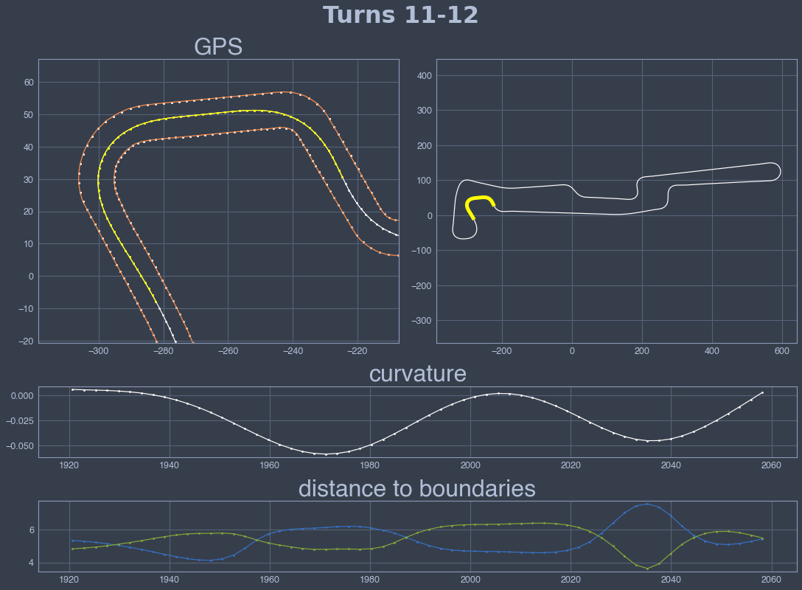
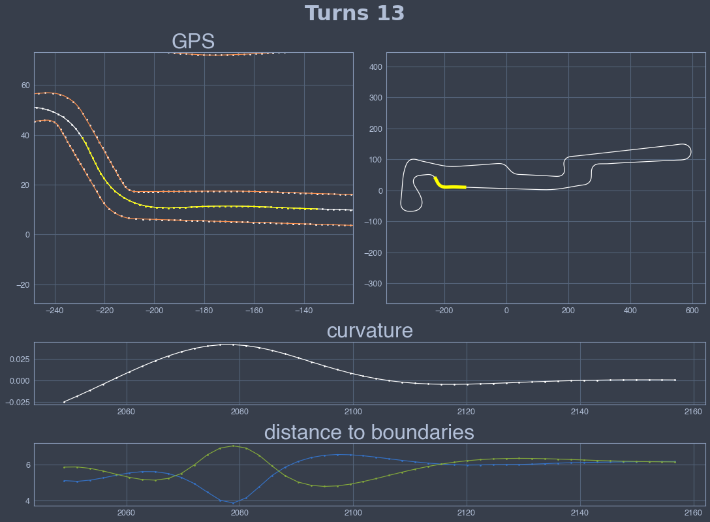

# Circuit preprocessor: Varano 2022


```python
import sys,os,inspect
fastest_lap_top_level=os.path.dirname(os.path.dirname(os.path.dirname(os.path.dirname(os.path.abspath(inspect.getfile(inspect.currentframe()))))))
sys.path.append(fastest_lap_top_level + '/examples/python')
import fastest_lap
import fastest_lap_utils
```


```python
options = "<options>"
options += "    <kml_files>"
options += "        <left>../../../database/tracks/varano/varano_left.kml</left>"
options += "        <right>../../../database/tracks/varano/varano_right.kml</right>"
options += "    </kml_files>"
options += "    <mode>equally-spaced</mode>"
options += "    <is_closed>true</is_closed>"
options += "    <number_of_elements>1000</number_of_elements>"
options += "    <xml_file_name>varano.xml</xml_file_name>"
options += "    <output_variables>"
options += "        <prefix>track/</prefix>"
options += "    </output_variables>"
options += "</options>"

fastest_lap.circuit_preprocessor(options)
```


```python
fastest_lap_utils.plot_turn(190, 415, "Turn 1-2")
fastest_lap_utils.plot_turn(550, 770, "Turn 3")
fastest_lap_utils.plot_turn(1000, 1200, "Turn 4-5")
fastest_lap_utils.plot_turn(1200, 1430, "Turn 6-7")
fastest_lap_utils.plot_turn(1560, 1710, "Turn 8")
fastest_lap_utils.plot_turn(1750, 1940, "Turns 9-10")
fastest_lap_utils.plot_turn(1920, 2060, "Turns 11-12")
fastest_lap_utils.plot_turn(2050, 2160, "Turns 13")
```


    

    


    

    


    

    


    

    


    

    


    

    


    

    


    

    

