# Circuit preprocessor: Zolder 2022


```python
import sys,os,inspect
fastest_lap_top_level=os.path.dirname(os.path.dirname(os.path.dirname(os.path.dirname(os.path.abspath(inspect.getfile(inspect.currentframe()))))))
sys.path.append(fastest_lap_top_level + '/examples/python')
import fastest_lap
import fastest_lap_utils
```


```python
options = "<options>"
options += "    <kml_files>"
options += "        <left>../../../database/tracks/zolder/zolder_left.kml</left>"
options += "        <right>../../../database/tracks/zolder/zolder_right.kml</right>"
options += "    </kml_files>"
options += "    <mode>equally-spaced</mode>"
options += "    <is_closed>true</is_closed>"
options += "    <number_of_elements>1000</number_of_elements>"
options += "    <xml_file_name>zolder.xml</xml_file_name>"
options += "    <output_variables>"
options += "        <prefix>track/</prefix>"
options += "    </output_variables>"
options += "</options>"

fastest_lap.circuit_preprocessor(options)
```


```python
fastest_lap_utils.plot_turn(90, 435, "Turn 1")
fastest_lap_utils.plot_turn(460, 690, "Turn 2")
fastest_lap_utils.plot_turn(690, 950, "Turn 3")
fastest_lap_utils.plot_turn(1000, 1330, "Turn 4")
fastest_lap_utils.plot_turn(1670, 1890, "Turns 5-6")
fastest_lap_utils.plot_turn(1890, 2240, "Turn 7")
fastest_lap_utils.plot_turn(2225, 2390, "Turns 8-9")
fastest_lap_utils.plot_turn(2370, 2480, "Turn 10")
fastest_lap_utils.plot_turn(2480, 2731, "Turn 11")
fastest_lap_utils.plot_turn(2945, 3100, "Turn 12")
fastest_lap_utils.plot_turn(3070, 3280, "Turns 13-14")
fastest_lap_utils.plot_turn(3510, 3770, "Turns 15-16")
```


    
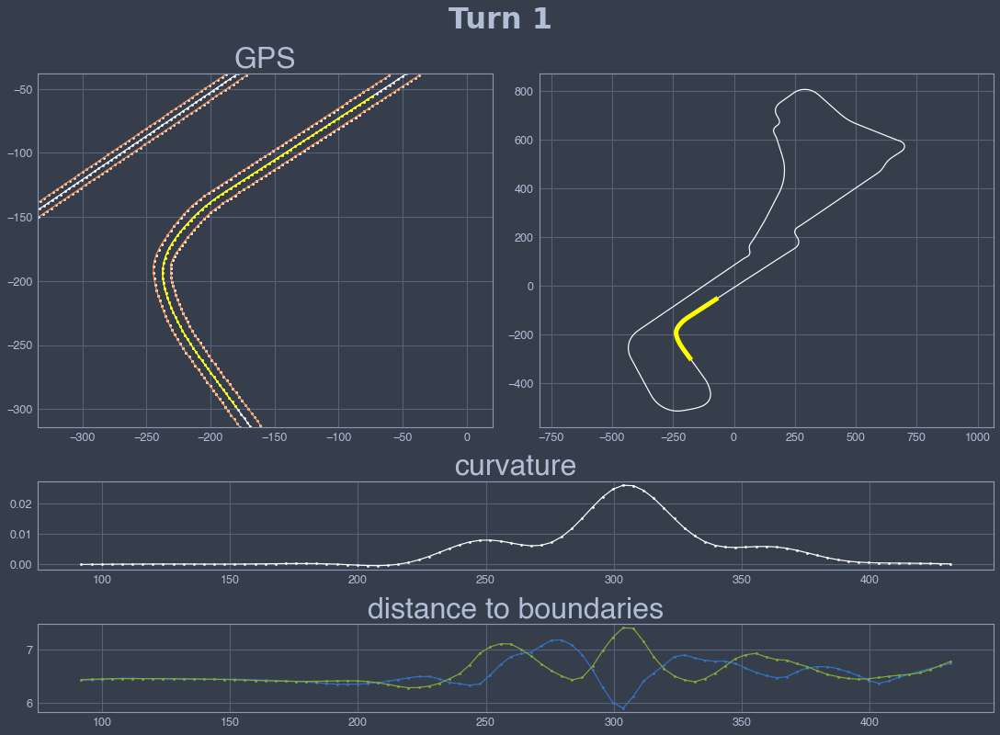
    


    
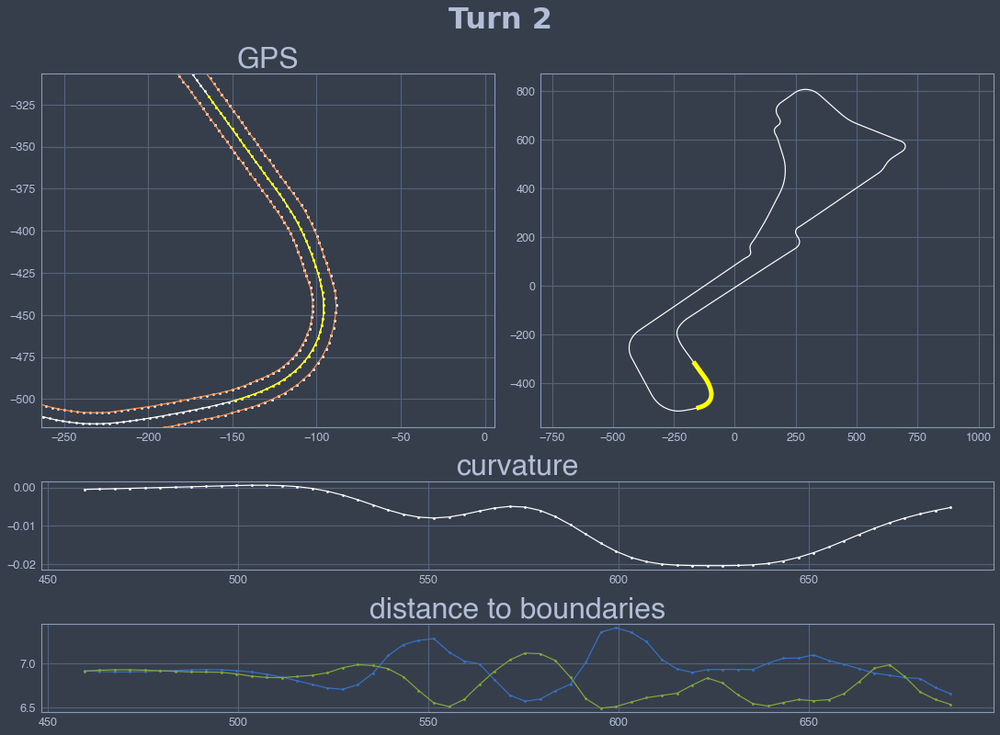
    


    
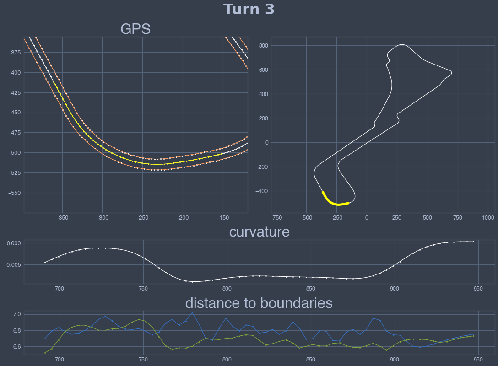
    


    
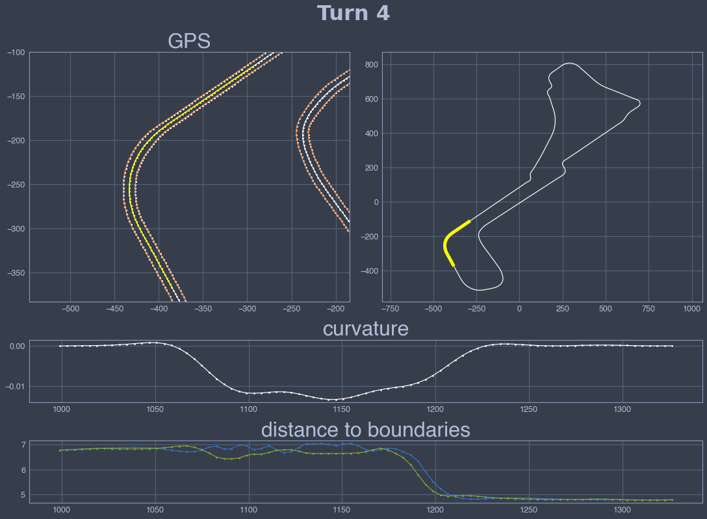
    


    

    


    
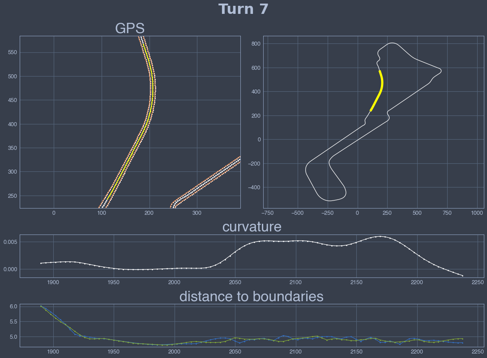
    


    
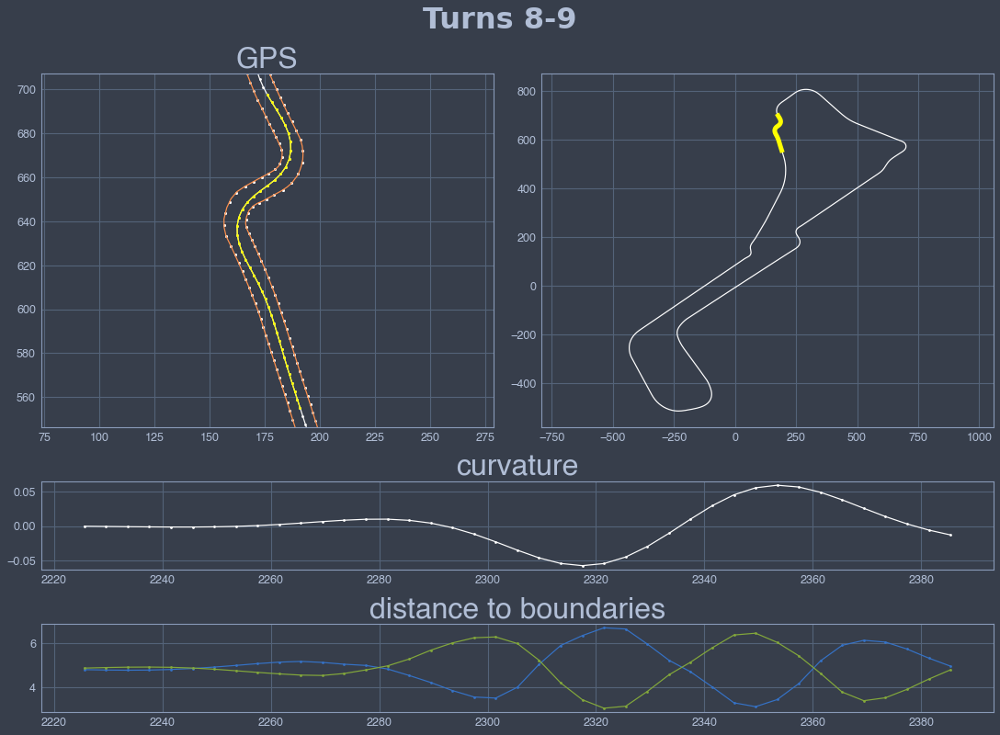
    


    
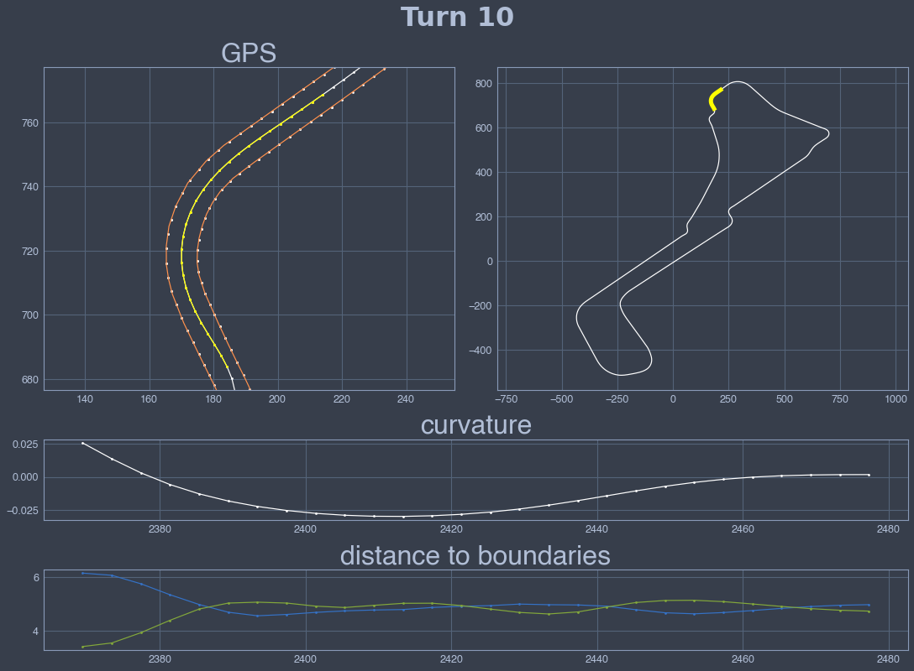
    


    
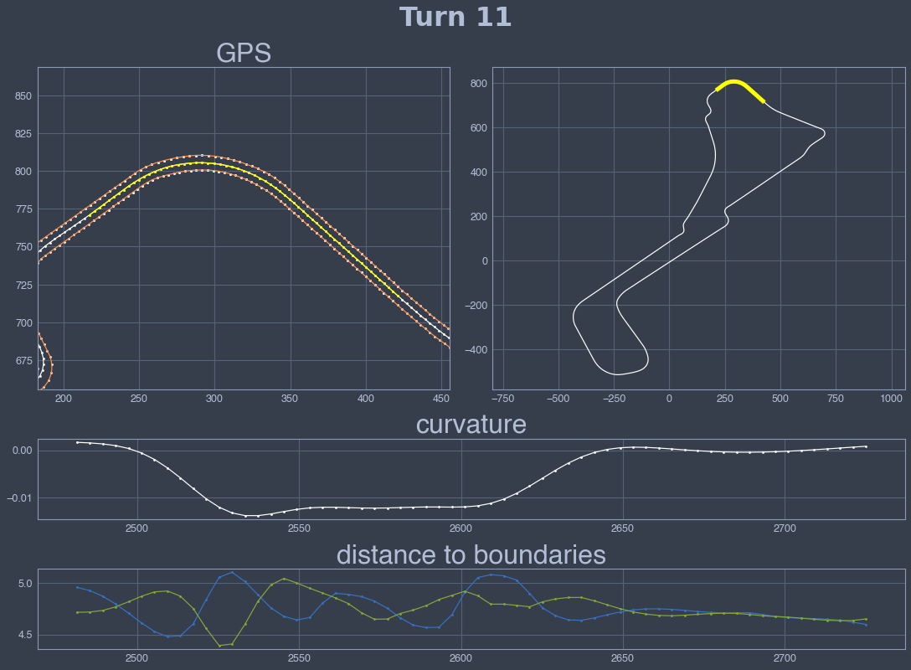
    


    
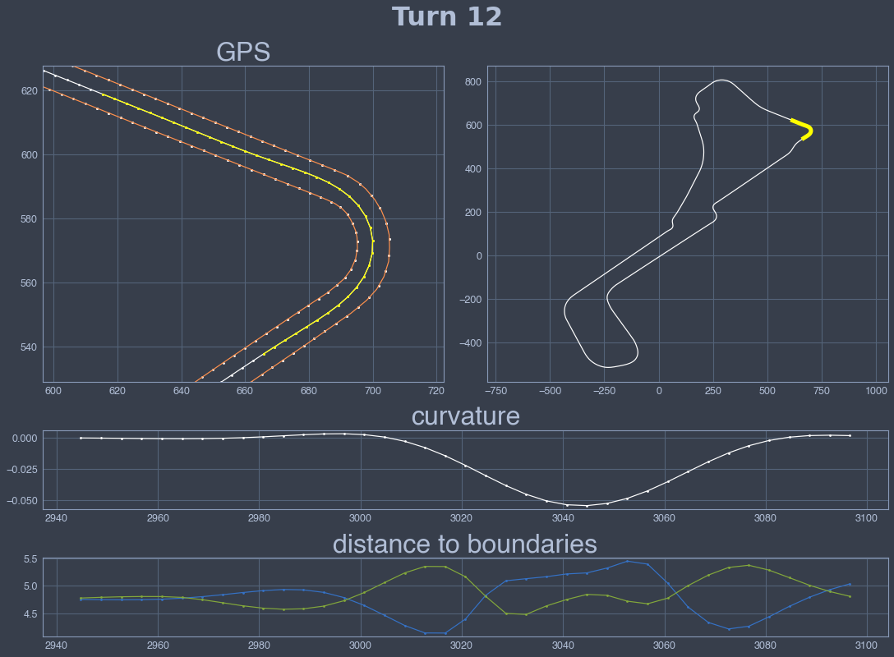
    


    
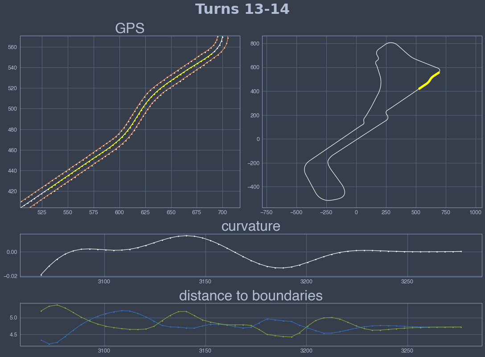
    


    
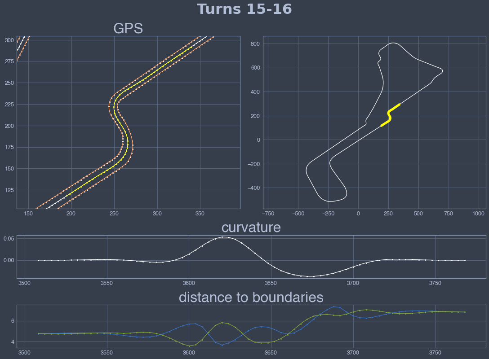
    

