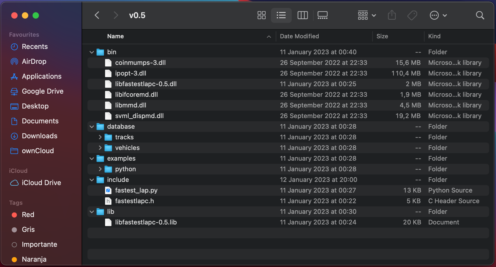

Installation
============

Fastest-lap is ready to use once you have the dynamic library ``libfastestlapc-VERSION``, plus other libraries such as Ipopt and Mumps. The following steps describe how to get such library. 

Windows 10 (Precompiled binaries)
---------------------------------

Prerequisites: none :)

Download the latest `release <https://github.com/juanmanzanero/fastest-lap/releases>`_ of Fastest-lap, and unzip its contents to your desired folder. If you don't want bad things to happen, keep all the files into their original directory relative to the root!

 * 📁 **bin** contains the Fastest-lap C++ dynamic library: ``libfastestlapc-VERSION.dll`` plus other dynamic libraries fastest-lap depends on. 
 * 📁 **include** contains the Fastest-lap C header ``fastestlapc.h`` and the python module ``fastest_lap.py`` 
 * 📁 `database <https://github.com/juanmanzanero/fastest-lap/tree/main/database>`_ includes track and vehicle models inputs 
 * 📁 `examples <https://github.com/juanmanzanero/fastest-lap/tree/main/examples>`_ contains python notebook examples

Linux and Mac 
-------------

Prerequisites: 
 * C/C++ and Fortran compilers
 * `CMake <https://cmake.org>`_
 * (mac) `Command line tools <https://www.freecodecamp.org/news/install-xcode-command-line-tools/>`_

Fastest-lap has been successfully compiled with:

.. admonition:: Mac

 * Apple clang version 13.0.0
 * GNU Fortran (Homebrew GCC 11.2.0_3) 11.2.0

.. admonition:: Linux

 * g++ (GCC) 11.2.0
 * GNU Fortran (GCC) 11.2.0

The steps to build this project using CMake are the usual: 

**1)** Set a variable ``FASTESTLAP`` to the top level directory

.. code-block:: console

  $ export FASTESTLAP=/path/to/fastest-lap

**2)** Create a build folder.

.. code-block:: console

  $ mkdir ${FASTESTLAP}/build

**3)** From the build folder, run cmake

.. code-block:: console

  $ cd ${FASTESTLAP}/build && cmake ..

The following options can be set to customise the compilation:

    * ``CMAKE_BUILD_TYPE``: Debug/Release (defaults to RELEASE) 
    * ``CMAKE_C_COMPILER``: /path/to/cc
    * ``CMAKE_CXX_COMPILER``: /path/to/cxx
    * ``CMAKE_Fortran_COMPILER``: /path/to/fc
    

At this stage, CMake will download and install all the thirdparty dependencies. This can take up to **30 minutes**

**4)** Compile

.. code-block:: console

    $ make

If make was successful, the dynamic library ``libfastestlapc.dylib`` (Mac) or ``libfastestlap.so`` (Linux) should be found in ``${FASTESTLAP}/build/lib``

**5)** (Optional but recommended) Test

.. code-block:: console

    $ ctest --verbose

You can also check-out this video where the steps are visualized (for Mac)

.. raw:: html

    

        <iframe src="https://youtu.be/F5xsIVLzNak" frameborder="0" allowfullscreen style="position: absolute; top: 0; left: 0; width: 100%; height: 100%;"></iframe>
    

Troubleshooting
---------------

If you encounter any issue while repeating the steps, first take a look in the `Issues section <https://github.com/juanmanzanero/fastest-lap/issues?q=is%3Aissue>`_ of the repository. Probably someone has been there before :). If still you cannot fix the issue, feel free to open a new issue.
