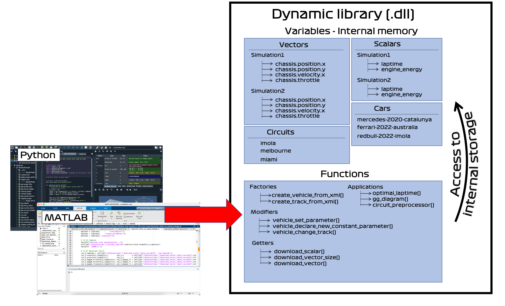

Overview
========

The philosophy of this software is to find the perfect balance between performance and versatility.
Code written in C++ is super fast and efficient, and scripting languages such as MATLAB and Python are versatile and perfect for data processing
and visualization, plus are well known to everybody.

What we came up with, it's a C++ world in the form of a `dynamic library <https://www.techopedia.com/definition/27133/dynamic-library>`_, that is
controlled through Python/MATLAB. This library (the ``.dll`` file for Windows, ``.dylib`` for Mac, and ``.so`` for Linux) is responsible for all the
heavy computations such as gg diagrams, laptime optimizations, and circuit preprocessors.

A dynamic library is a collection of **functions** plus **internal memory** to store data (scalars, vectors, cars, circuits,...). 
The functions are the entry port to the Fastest-lap library from Python/MATLAB. 
One can create/modify/delete variables in the internal memory, and run applications such as gg-diagrams, optimal laptimes, and circuit preprocessings.
After an application has been run, the results will be stored in the internal memory, which can be later `downloaded` to Python/MATLAB.

Examples of the functions you can find are:

- **Factories**: to create variables in the internal memory (e.g. to create a car, a circuit, a scalar variable, a vector)
- **Modifiers**: to modify variables stored in the internal memory (e.g. to modify a setup parameter of a created car)
- **Applications**: to run simulations: circuit preprocessor, gg diagram, and optimal laptime
- **Getters**: to retrieve the results and data back to Python/MATLAB
- **Destructors**: to delete variables once they are not needed anymore

The variables are internally stored by name (as in every programming language), and there can only one and only variable with the same name.
That is, if there's a ``vehicle`` called ``"my_car"``, one cannot create another ``vehicle`` called ``"my_car"`` or a ``vector`` called ``"my_car"``.

Also, one can use *paths* to group variables. For example, in the figure, there are the vector variables ``Simulation1/chassis.position.x`` and ``Simulation2/chassis.position.x``

With the use of this methodology, it is very easy to perform computations. For example, what the :ref:`quickstart example <quickstart>` does is:

1. Create a car by the name of ``"car"``. This will add a variable of type ``"vehicle"`` into the internal memory with the name ``"car"``
2. Create a circuit by the name of ``"catalunya"``. This will add a variable of type ``"track"`` into the internal memory with the name ``"catalunya"``
3. Run optimal laptime. The output of this function is a collection of timehistories from the simulation.
   These timehistories are new variables of type ``vector`` stored in the internal memory under the prefix ``run/``, for example,
   ``"run/chassis.position.x"``, ``"run/chassis.position.y"``, ``"run/chassis.velocity.x"``, ...
4. Download results. The vector and scalar tables can be emptied afterwards by calling

    .. code-block:: python
	
     fastest_lap.clear_tables_by_prefix("run/")
