# Circuit preprocessor: Catalunya 2022


```python
import sys,os,inspect
sys.path.append(os.path.dirname(os.path.dirname(os.path.abspath(inspect.getfile(inspect.currentframe())))))
import fastest_lap
import fastest_lap_utils
```


```python
options = "<options>"
options += "    <kml_files>"
options += "        <left>../../../database/tracks/catalunya_2022/catalunya_2022_left.kml</left>"
options += "        <right>../../../database/tracks/catalunya_2022/catalunya_2022_right.kml</right>"
options += "    </kml_files>"
options += "    <mode>equally-spaced</mode>"
options += "    <is_closed>true</is_closed>"
options += "    <number_of_elements>1000</number_of_elements>"
options += "    <xml_file_name>catalunya_2022.xml</xml_file_name>"
options += "    <output_variables>"
options += "        <prefix>track/</prefix>"
options += "    </output_variables>"
options += "</options>"

fastest_lap.circuit_preprocessor(options)
```


```python
fastest_lap_utils.plot_turn(934.0, 1214.0, "Turns 1-2");
fastest_lap_utils.plot_turn(1214.0, 1681.0, "Turn 3");
fastest_lap_utils.plot_turn(1774.0, 2101.0, "Turn 4");
fastest_lap_utils.plot_turn(2241.0, 2428.0, "Turn 5");
fastest_lap_utils.plot_turn(2428.0, 2615.0, "Turn 6");
fastest_lap_utils.plot_turn(2615.0, 2895.0, "Turns 7-8");
fastest_lap_utils.plot_turn(2989.0, 3222.0, "Turn 9");
fastest_lap_utils.plot_turn(3549.0, 3876.0, "Turns 10-11");
fastest_lap_utils.plot_turn(3857.0, 4109.0, "Turn 12");
fastest_lap_utils.plot_turn(4156.0, 4296.0, "Turn 13");
fastest_lap_utils.plot_turn(4296.0, 4446.0, "Turns 14-15");
fastest_lap_utils.plot_turn(4436.0, 4623.0, "Turn 16");
```


    
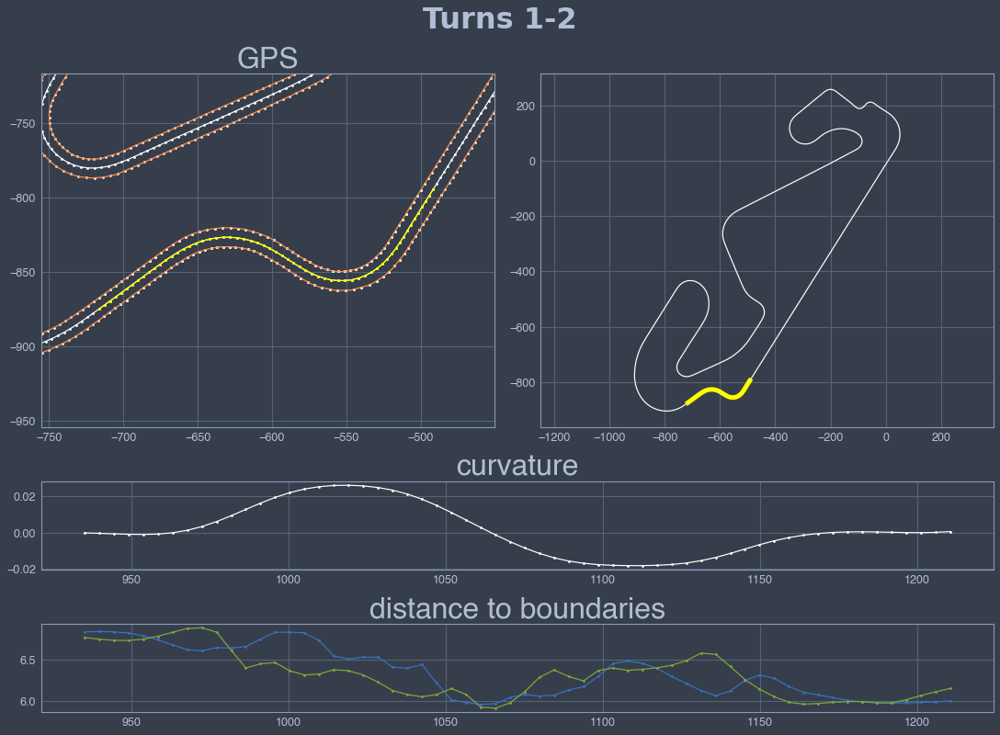
    


    
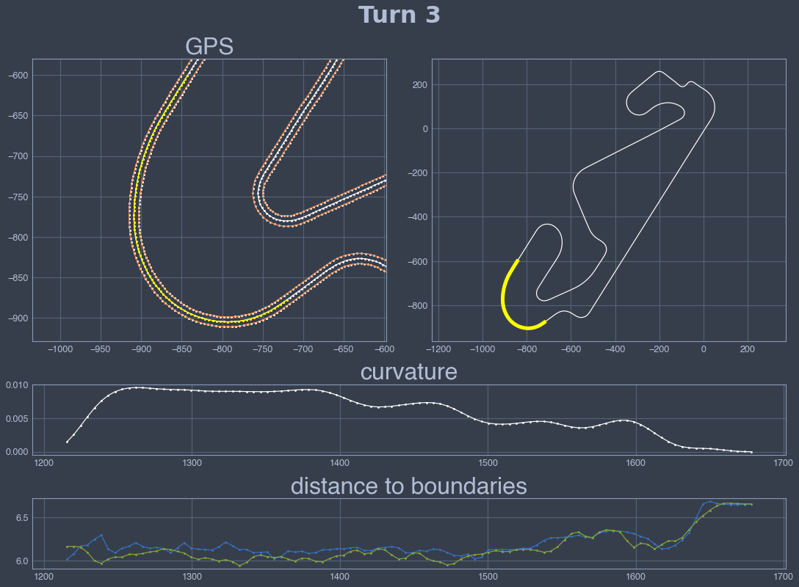
    


    
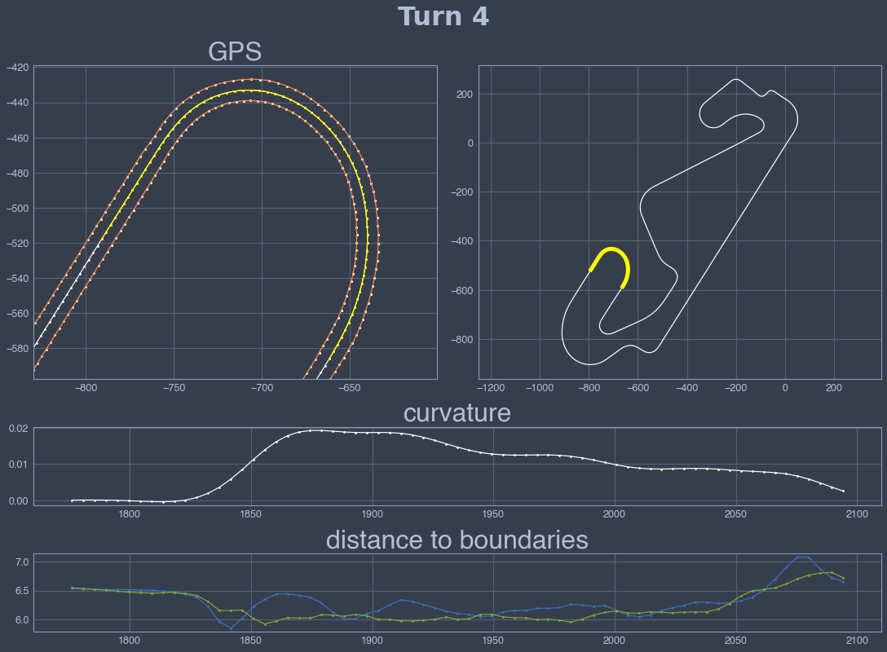
    


    
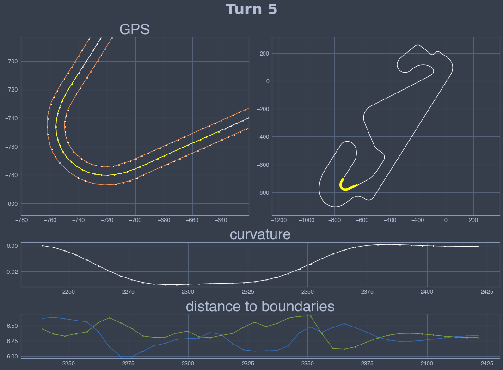
    


    
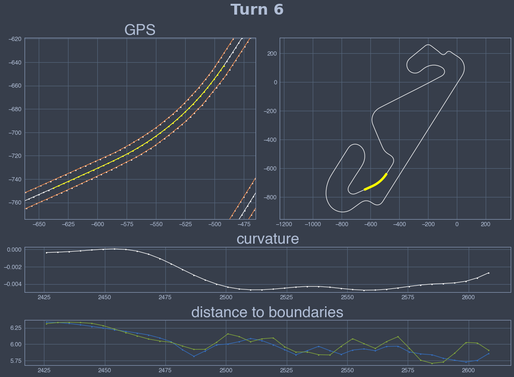
    


    
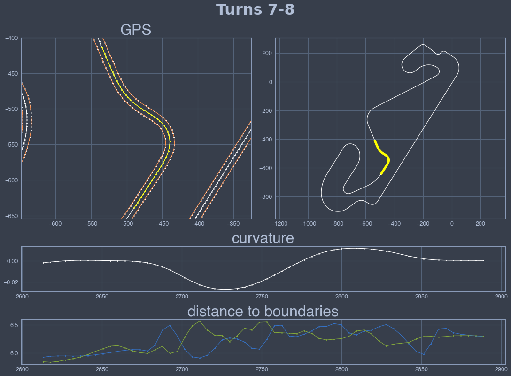
    


    
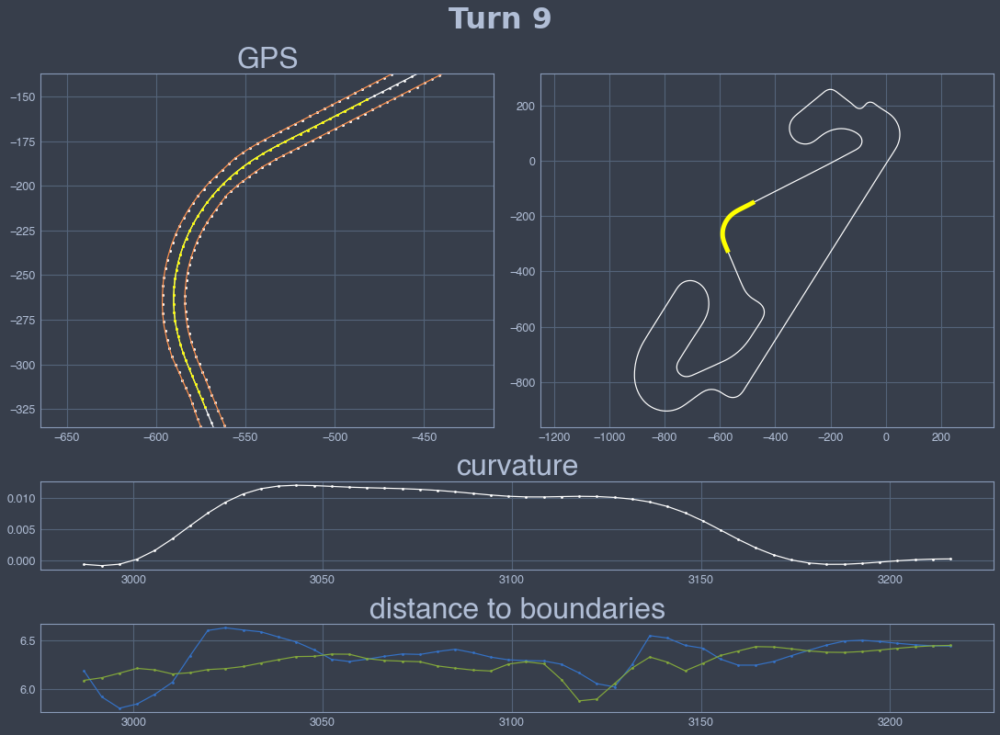
    


    
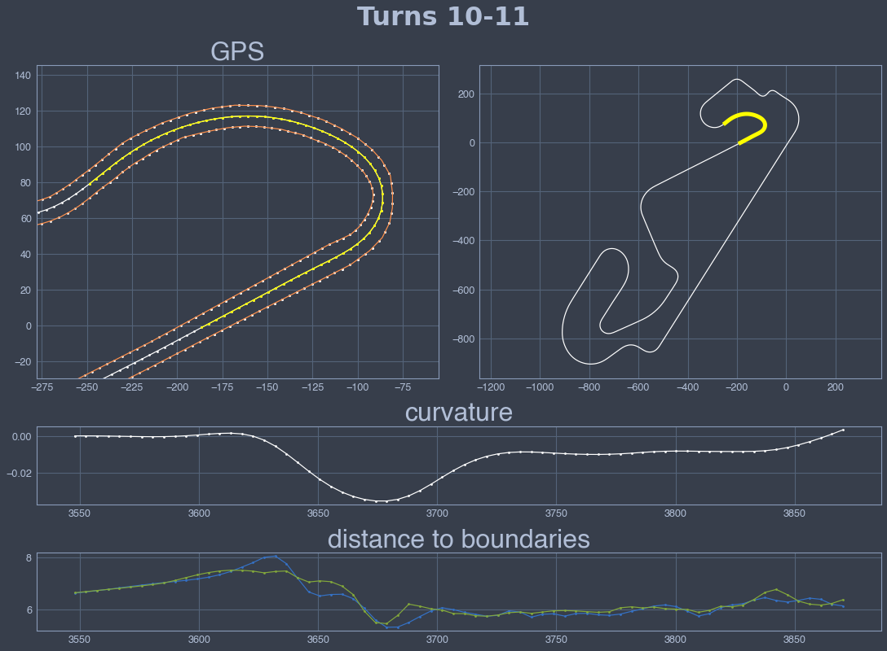
    


    
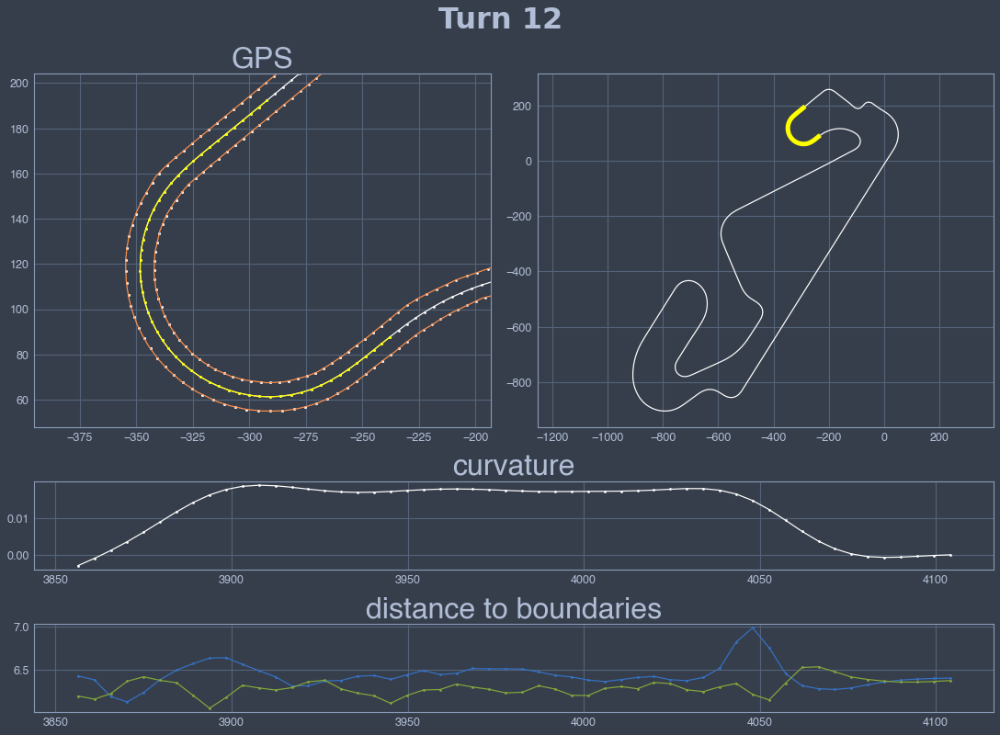
    


    
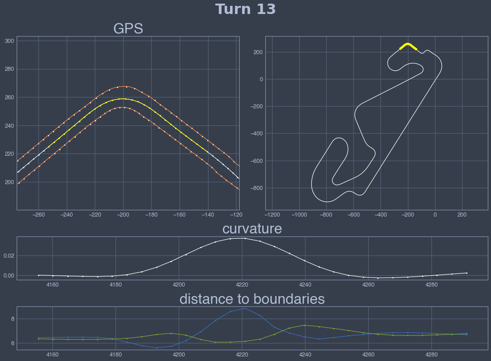
    


    
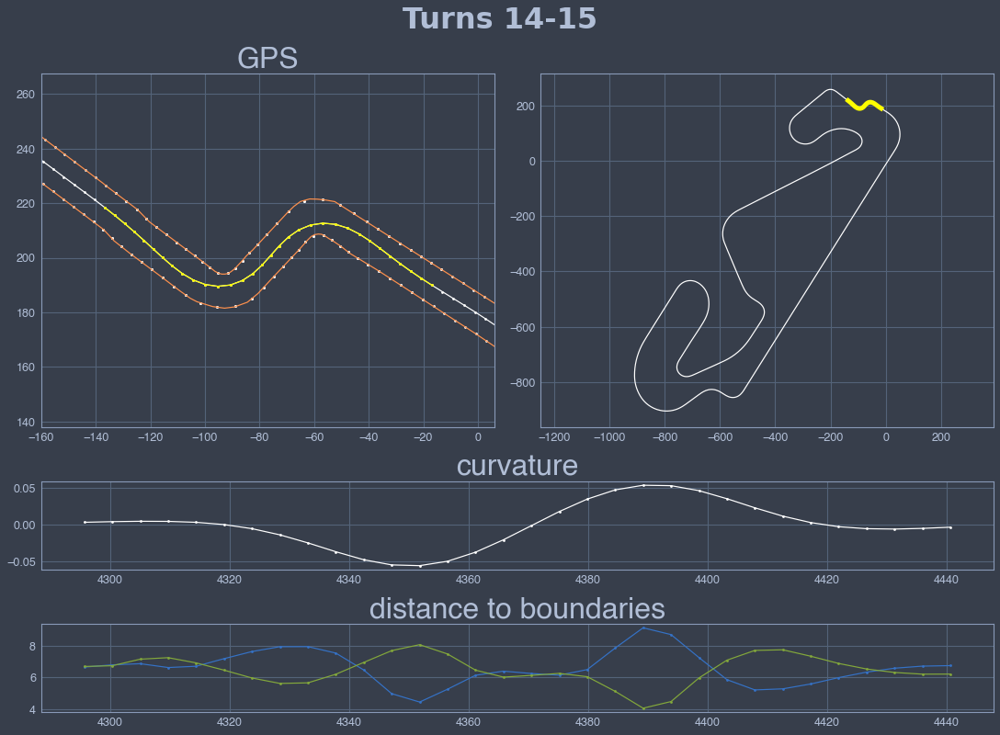
    


    
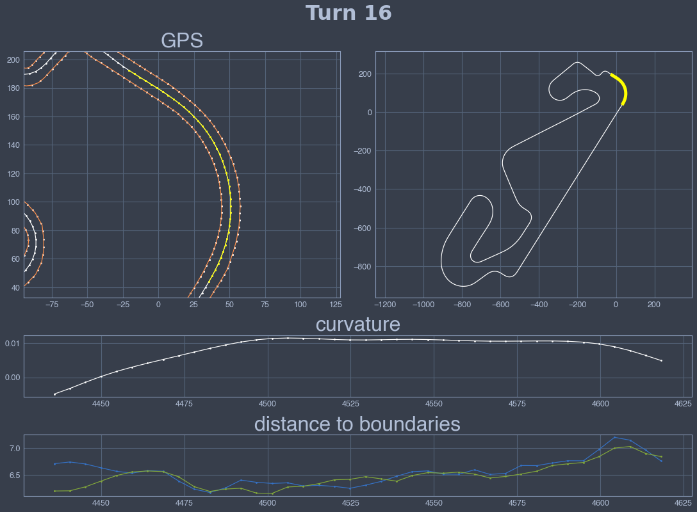
    

