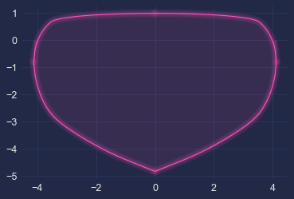

# G-G diagram


```python
# Put parent folder in the pythonpath
import sys,os,inspect
sys.path.append(os.path.dirname(os.path.dirname(os.path.dirname(os.path.abspath(inspect.getfile(inspect.currentframe()))))))
import fastest_lap
from fastest_lap import KMH
```


```python
# Load vehicle
vehicle=fastest_lap.load_vehicle("car","limebeer-2014-f1","../../../../database/limebeer-2014-f1.xml");
```


```python
# Compute and plot gg_diagram
[ay,ay_minus,ax_max,ax_min] = fastest_lap.gg_diagram(vehicle,250.0*KMH,100);

```


```python
import matplotlib.pyplot as plt
import mplcyberpunk

plt.style.use("cyberpunk")
plt.plot(ay,ax_max,color='#FE53BB');
plt.plot(ay,ax_min,color='#FE53BB');
plt.plot(ay_minus,ax_max,color='#FE53BB');
plt.plot(ay_minus,ax_min,color='#FE53BB');
mplcyberpunk.add_glow_effects()
```


    

    


```python

```
