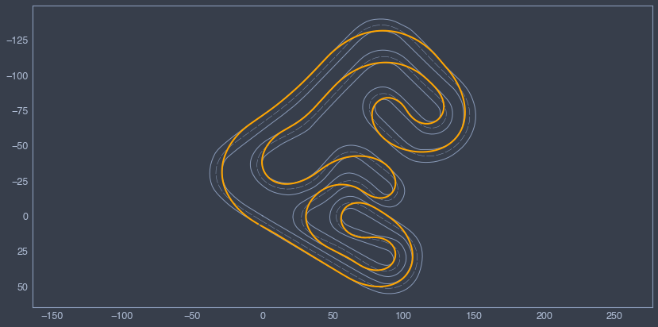
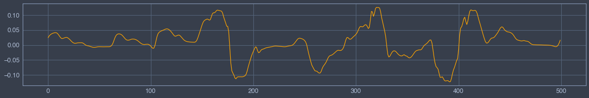
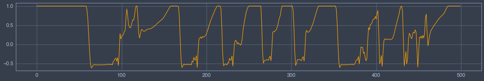

# Optimal Lap Time


```python
# Put parent folder in the pythonpath
import sys,os,inspect

import matplotlib.pyplot as plt
sys.path.append(os.path.dirname(os.path.dirname(os.path.dirname(os.path.abspath(inspect.getfile(inspect.currentframe()))))))
import fastest_lap
from fastest_lap import KMH
```


```python
# Load vehicle
vehicle=fastest_lap.load_vehicle("car","roberto-lot-kart-2016","../../../../database/roberto-lot-kart-2016.xml");
```


```python
# Load track
track=fastest_lap.load_track("../../../../database/vendrell.xml","catalunya",0.2);
```


```python
# Compute optimal laptime
data = fastest_lap.optimal_laptime(vehicle,track,500,["x","y","delta","throttle"]);
x = data[0];
y = data[1];
delta = data[2];
throttle = data[3];
```

## GPS


```python
fastest_lap.plot_optimal_laptime(x,y,track);
plt.gca().invert_yaxis();
```


    

    


## Steering


```python
plt.figure(figsize=(20,3))
plt.plot(delta,color="orange");
```


    

    


## Torque


```python
plt.figure(figsize=(20,3))
plt.plot(throttle,color="orange");
```


    

    


```python

```
